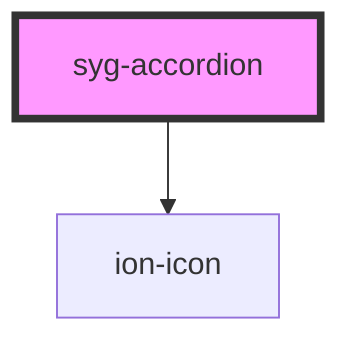

# syg-accordion

Accordions provide collapsible sections in your content to reduce vertical space while providing a way of organizing and grouping information. All `syg-accordion` components should be grouped inside `syg-accordion-group` components.

## Anatomy

### Header

The `header` slot is used as the toggle that will expand or collapse your accordion. We recommend you use an `syg-item` here to take advantage of the accessibility and theming functionalities.

When using `syg-item` in the `header` slot, the `syg-item`'s `button` prop is set to `true` and the `detail` prop is set to `false`. In addition, we will also automatically add a toggle icon to the `syg-item`. This icon will automatically be rotated when you expand or collapse the accordion. See [Customizing Icons](#customizing-icons) for more information.

### Content

The `content` slot is used as the part of the accordion that is revealed or hidden depending on the state of your accordion. You can place anything here except for another `syg-content` instance as only one instance of `syg-content` should be added per page.

## Customizing Icons

When using an `syg-item` in the `header` slot, we automatically add an `ion-icon`. The type of icon used can be controlled by the `toggleIcon` property, and the slot it is added to can be controlled with the `toggleIconSlot` property.

If you would like to manage the icon yourself or use an icon that is not an `ion-icon`, you can add the `syg-accordion-toggle-icon` class to the icon element.

Regardless of which option you choose, the icon will automatically be rotated when you expand or collapse the accordion.

## Expansion Styles

### Built in Styles

There are two built in expansion styles: `compact` and `inset`. This expansion style is set via the `expand` property on `syg-accordion-group`. When `expand="inset"`, the accordion group is given a border radius. On `md` mode, the entire accordion will shift down when it is opened.

### Custom Styles

You can customize the expansion behavior by styling based on the accordion's state:

```css
syg-accordion {
  margin: 0 auto;
}

syg-accordion.accordion-expanding,
syg-accordion.accordion-expanded {
  width: calc(100% - 32px);
  margin: 16px auto;
}
```

This example will cause an accordion to have its width shrink when it is opened. You can also style the accordion differently when it is closing by targeting the `.accordion-collapsing` and `.accordion-collapsed` classes.

If you need to target specific pieces of the accordion, we recommend targeting the element directly. For example, if you want to customize the `syg-item` in your `header` slot when the accordion is expanded, you can use the following selector:

```css
syg-accordion.accordion-expanding syg-item[slot="header"],
syg-accordion.accordion-expanded syg-item[slot="header"] {
  --color: red;
}
```

This example will set the text color of the header `syg-item` to red when the accordion is expanded.

## Accessibility

### Animations

By default, animations are enabled when expanding or collapsing an accordion item. Animations will be automatically disabled when the `prefers-reduced-motion` media query is supported and set to `reduce`. For browsers that do not support this, animations can be disabled by setting the `animated` config in your Ionic Framework app.

### Keyboard Navigation

When used inside an `syg-accordion-group`, `syg-accordion` has full keyboard support for interacting with the component. The following table details what each key does:

| Key                | Function                                                     |
| ------------------ | ------------------------------------------------------------ |
| `Space` or `Enter` | When focus is on the accordion header, the accordion will collapse or expand depending on the state of the component. |
| `Tab`              | Moves focus to the next focusable element.                   |
| `Shift` + `Tab`    | Moves focus to the previous focusable element.               |
| `Down Arrow`       | - When focus is on an accordion header, moves focus to the next accordion header.  <br />- When focus is on the last accordion header, moves focus to the first accordion header. |
| `Up Arrow`         | - When focus is on an accordion header, moves focus to the previous accordion header.  <br />- When focus is on the first accordion header, moves focus to the last accordion header. |
| `Home`             | When focus is on an accordion header, moves focus to the first accordion header. |
| `End`              | When focus is on an accordion header, moves focus to the last accordion header. |

<!-- Auto Generated Below -->


## Usage

### Angular

```html
<!-- Basic -->
<syg-accordion-group>
  <syg-accordion value="colors">
    <syg-item slot="header">
      <syg-label>Colors</syg-label>
    </syg-item>

    <syg-list slot="content">
      <syg-item>
        <syg-label>Red</syg-label>
      </syg-item>
      <syg-item>
        <syg-label>Green</syg-label>
      </syg-item>
      <syg-item>
        <syg-label>Blue</syg-label>
      </syg-item>
    </syg-list>
  </syg-accordion>
  <syg-accordion value="shapes">
    <syg-item slot="header">
      <syg-label>Shapes</syg-label>
    </syg-item>

    <syg-list slot="content">
      <syg-item>
        <syg-label>Circle</syg-label>
      </syg-item>
      <syg-item>
        <syg-label>Triangle</syg-label>
      </syg-item>
      <syg-item>
        <syg-label>Square</syg-label>
      </syg-item>
    </syg-list>
  </syg-accordion>
  <syg-accordion value="numbers">
    <syg-item slot="header">
      <syg-label>Numbers</syg-label>
    </syg-item>

    <syg-list slot="content">
      <syg-item>
        <syg-label>1</syg-label>
      </syg-item>
      <syg-item>
        <syg-label>2</syg-label>
      </syg-item>
      <syg-item>
        <syg-label>3</syg-label>
      </syg-item>
    </syg-list>
  </syg-accordion>
</syg-accordion-group>

<!-- Custom Icon -->
<syg-accordion-group>
  <syg-accordion value="colors" toggle-icon="arrow-down-circle">
    <syg-item slot="header">
      <syg-label>Colors</syg-label>
    </syg-item>

    <syg-list slot="content">
      <syg-item>
        <syg-label>Red</syg-label>
      </syg-item>
      <syg-item>
        <syg-label>Green</syg-label>
      </syg-item>
      <syg-item>
        <syg-label>Blue</syg-label>
      </syg-item>
    </syg-list>
  </syg-accordion>
  <syg-accordion value="shapes" toggle-icon="arrow-down-circle">
    <syg-item slot="header">
      <syg-label>Shapes</syg-label>
    </syg-item>

    <syg-list slot="content">
      <syg-item>
        <syg-label>Circle</syg-label>
      </syg-item>
      <syg-item>
        <syg-label>Triangle</syg-label>
      </syg-item>
      <syg-item>
        <syg-label>Square</syg-label>
      </syg-item>
    </syg-list>
  </syg-accordion>
  <syg-accordion value="numbers" toggle-icon="arrow-down-circle">
    <syg-item slot="header">
      <syg-label>Numbers</syg-label>
    </syg-item>

    <syg-list slot="content">
      <syg-item>
        <syg-label>1</syg-label>
      </syg-item>
      <syg-item>
        <syg-label>2</syg-label>
      </syg-item>
      <syg-item>
        <syg-label>3</syg-label>
      </syg-item>
    </syg-list>
  </syg-accordion>
</syg-accordion-group>

<!-- Open Accordion -->
<syg-accordion-group value="colors">
  <syg-accordion value="colors">
    <syg-item slot="header">
      <syg-label>Colors</syg-label>
    </syg-item>

    <syg-list slot="content">
      <syg-item>
        <syg-label>Red</syg-label>
      </syg-item>
      <syg-item>
        <syg-label>Green</syg-label>
      </syg-item>
      <syg-item>
        <syg-label>Blue</syg-label>
      </syg-item>
    </syg-list>
  </syg-accordion>
  <syg-accordion value="shapes">
    <syg-item slot="header">
      <syg-label>Shapes</syg-label>
    </syg-item>

    <syg-list slot="content">
      <syg-item>
        <syg-label>Circle</syg-label>
      </syg-item>
      <syg-item>
        <syg-label>Triangle</syg-label>
      </syg-item>
      <syg-item>
        <syg-label>Square</syg-label>
      </syg-item>
    </syg-list>
  </syg-accordion>
  <syg-accordion value="numbers">
    <syg-item slot="header">
      <syg-label>Numbers</syg-label>
    </syg-item>

    <syg-list slot="content">
      <syg-item>
        <syg-label>1</syg-label>
      </syg-item>
      <syg-item>
        <syg-label>2</syg-label>
      </syg-item>
      <syg-item>
        <syg-label>3</syg-label>
      </syg-item>
    </syg-list>
  </syg-accordion>
</syg-accordion-group>

<!-- Multiple Accordions -->
<syg-accordion-group [multiple]="true" [value]="['colors', 'numbers']">
  <syg-accordion value="colors">
    <syg-item slot="header">
      <syg-label>Colors</syg-label>
    </syg-item>

    <syg-list slot="content">
      <syg-item>
        <syg-label>Red</syg-label>
      </syg-item>
      <syg-item>
        <syg-label>Green</syg-label>
      </syg-item>
      <syg-item>
        <syg-label>Blue</syg-label>
      </syg-item>
    </syg-list>
  </syg-accordion>
  <syg-accordion value="shapes">
    <syg-item slot="header">
      <syg-label>Shapes</syg-label>
    </syg-item>

    <syg-list slot="content">
      <syg-item>
        <syg-label>Circle</syg-label>
      </syg-item>
      <syg-item>
        <syg-label>Triangle</syg-label>
      </syg-item>
      <syg-item>
        <syg-label>Square</syg-label>
      </syg-item>
    </syg-list>
  </syg-accordion>
  <syg-accordion value="numbers">
    <syg-item slot="header">
      <syg-label>Numbers</syg-label>
    </syg-item>

    <syg-list slot="content">
      <syg-item>
        <syg-label>1</syg-label>
      </syg-item>
      <syg-item>
        <syg-label>2</syg-label>
      </syg-item>
      <syg-item>
        <syg-label>3</syg-label>
      </syg-item>
    </syg-list>
  </syg-accordion>
</syg-accordion-group>
```

**component.html**
```html
<!-- Getting and setting the state of the accordion group -->
<syg-accordion-group value="numbers">
  <syg-accordion value="colors">
    <syg-item slot="header">
      <syg-label>Colors</syg-label>
    </syg-item>

    <syg-list slot="content">
      <syg-item>
        <syg-label>Red</syg-label>
      </syg-item>
      <syg-item>
        <syg-label>Green</syg-label>
      </syg-item>
      <syg-item>
        <syg-label>Blue</syg-label>
      </syg-item>
    </syg-list>
  </syg-accordion>
  <syg-accordion value="shapes">
    <syg-item slot="header">
      <syg-label>Shapes</syg-label>
    </syg-item>

    <syg-list slot="content">
      <syg-item>
        <syg-label>Circle</syg-label>
      </syg-item>
      <syg-item>
        <syg-label>Triangle</syg-label>
      </syg-item>
      <syg-item>
        <syg-label>Square</syg-label>
      </syg-item>
    </syg-list>
  </syg-accordion>
  <syg-accordion value="numbers">
    <syg-item slot="header">
      <syg-label>Numbers</syg-label>
    </syg-item>

    <syg-list slot="content">
      <syg-item>
        <syg-label>1</syg-label>
      </syg-item>
      <syg-item>
        <syg-label>2</syg-label>
      </syg-item>
      <syg-item>
        <syg-label>3</syg-label>
      </syg-item>
    </syg-list>
  </syg-accordion>
</syg-accordion-group>

<syg-button (click)="logAccordionValue()">Log Value of Accordion Group</syg-button>
<syg-button (click)="closeAccordion()">Close All Accordions</syg-button>
```

**component.ts**
```typescript
import { Component, ViewChild } from '@angular/core';
import { IonAccordionGroup } from '@ionic/angular';

@Component({…})
export class MyComponent {
  @ViewChild(IonAccordionGroup, { static: true }) accordionGroup: IonAccordionGroup;
  constructor() {}

  logAccordionValue() {
    console.log(this.accordionGroup.value);
  }

  closeAccordion() {
    this.accordionGroup.value = undefined;
  }
}
```


### Javascript

```html
<!-- Basic -->
<syg-accordion-group>
  <syg-accordion value="colors">
    <syg-item slot="header">
      <syg-label>Colors</syg-label>
    </syg-item>

    <syg-list slot="content">
      <syg-item>
        <syg-label>Red</syg-label>
      </syg-item>
      <syg-item>
        <syg-label>Green</syg-label>
      </syg-item>
      <syg-item>
        <syg-label>Blue</syg-label>
      </syg-item>
    </syg-list>
  </syg-accordion>
  <syg-accordion value="shapes">
    <syg-item slot="header">
      <syg-label>Shapes</syg-label>
    </syg-item>

    <syg-list slot="content">
      <syg-item>
        <syg-label>Circle</syg-label>
      </syg-item>
      <syg-item>
        <syg-label>Triangle</syg-label>
      </syg-item>
      <syg-item>
        <syg-label>Square</syg-label>
      </syg-item>
    </syg-list>
  </syg-accordion>
  <syg-accordion value="numbers">
    <syg-item slot="header">
      <syg-label>Numbers</syg-label>
    </syg-item>

    <syg-list slot="content">
      <syg-item>
        <syg-label>1</syg-label>
      </syg-item>
      <syg-item>
        <syg-label>2</syg-label>
      </syg-item>
      <syg-item>
        <syg-label>3</syg-label>
      </syg-item>
    </syg-list>
  </syg-accordion>
</syg-accordion-group>

<!-- Custom Icon -->
<syg-accordion-group>
  <syg-accordion value="colors" toggle-icon="arrow-down-circle">
    <syg-item slot="header">
      <syg-label>Colors</syg-label>
    </syg-item>

    <syg-list slot="content">
      <syg-item>
        <syg-label>Red</syg-label>
      </syg-item>
      <syg-item>
        <syg-label>Green</syg-label>
      </syg-item>
      <syg-item>
        <syg-label>Blue</syg-label>
      </syg-item>
    </syg-list>
  </syg-accordion>
  <syg-accordion value="shapes" toggle-icon="arrow-down-circle">
    <syg-item slot="header">
      <syg-label>Shapes</syg-label>
    </syg-item>

    <syg-list slot="content">
      <syg-item>
        <syg-label>Circle</syg-label>
      </syg-item>
      <syg-item>
        <syg-label>Triangle</syg-label>
      </syg-item>
      <syg-item>
        <syg-label>Square</syg-label>
      </syg-item>
    </syg-list>
  </syg-accordion>
  <syg-accordion value="numbers" toggle-icon="arrow-down-circle">
    <syg-item slot="header">
      <syg-label>Numbers</syg-label>
    </syg-item>

    <syg-list slot="content">
      <syg-item>
        <syg-label>1</syg-label>
      </syg-item>
      <syg-item>
        <syg-label>2</syg-label>
      </syg-item>
      <syg-item>
        <syg-label>3</syg-label>
      </syg-item>
    </syg-list>
  </syg-accordion>
</syg-accordion-group>

<!-- Open Accordion -->
<syg-accordion-group value="colors">
  <syg-accordion value="colors">
    <syg-item slot="header">
      <syg-label>Colors</syg-label>
    </syg-item>

    <syg-list slot="content">
      <syg-item>
        <syg-label>Red</syg-label>
      </syg-item>
      <syg-item>
        <syg-label>Green</syg-label>
      </syg-item>
      <syg-item>
        <syg-label>Blue</syg-label>
      </syg-item>
    </syg-list>
  </syg-accordion>
  <syg-accordion value="shapes">
    <syg-item slot="header">
      <syg-label>Shapes</syg-label>
    </syg-item>

    <syg-list slot="content">
      <syg-item>
        <syg-label>Circle</syg-label>
      </syg-item>
      <syg-item>
        <syg-label>Triangle</syg-label>
      </syg-item>
      <syg-item>
        <syg-label>Square</syg-label>
      </syg-item>
    </syg-list>
  </syg-accordion>
  <syg-accordion value="numbers">
    <syg-item slot="header">
      <syg-label>Numbers</syg-label>
    </syg-item>

    <syg-list slot="content">
      <syg-item>
        <syg-label>1</syg-label>
      </syg-item>
      <syg-item>
        <syg-label>2</syg-label>
      </syg-item>
      <syg-item>
        <syg-label>3</syg-label>
      </syg-item>
    </syg-list>
  </syg-accordion>
</syg-accordion-group>

<!-- Multiple Accordions -->
<syg-accordion-group multiple="true" id="multiple">
  <syg-accordion value="colors">
    <syg-item slot="header">
      <syg-label>Colors</syg-label>
    </syg-item>

    <syg-list slot="content">
      <syg-item>
        <syg-label>Red</syg-label>
      </syg-item>
      <syg-item>
        <syg-label>Green</syg-label>
      </syg-item>
      <syg-item>
        <syg-label>Blue</syg-label>
      </syg-item>
    </syg-list>
  </syg-accordion>
  <syg-accordion value="shapes">
    <syg-item slot="header">
      <syg-label>Shapes</syg-label>
    </syg-item>

    <syg-list slot="content">
      <syg-item>
        <syg-label>Circle</syg-label>
      </syg-item>
      <syg-item>
        <syg-label>Triangle</syg-label>
      </syg-item>
      <syg-item>
        <syg-label>Square</syg-label>
      </syg-item>
    </syg-list>
  </syg-accordion>
  <syg-accordion value="numbers">
    <syg-item slot="header">
      <syg-label>Numbers</syg-label>
    </syg-item>

    <syg-list slot="content">
      <syg-item>
        <syg-label>1</syg-label>
      </syg-item>
      <syg-item>
        <syg-label>2</syg-label>
      </syg-item>
      <syg-item>
        <syg-label>3</syg-label>
      </syg-item>
    </syg-list>
  </syg-accordion>
</syg-accordion-group>

<!-- Getting and setting the state of the accordion group -->
<syg-accordion-group value="numbers" id="state">
  <syg-accordion value="colors">
    <syg-item slot="header">
      <syg-label>Colors</syg-label>
    </syg-item>

    <syg-list slot="content">
      <syg-item>
        <syg-label>Red</syg-label>
      </syg-item>
      <syg-item>
        <syg-label>Green</syg-label>
      </syg-item>
      <syg-item>
        <syg-label>Blue</syg-label>
      </syg-item>
    </syg-list>
  </syg-accordion>
  <syg-accordion value="shapes">
    <syg-item slot="header">
      <syg-label>Shapes</syg-label>
    </syg-item>

    <syg-list slot="content">
      <syg-item>
        <syg-label>Circle</syg-label>
      </syg-item>
      <syg-item>
        <syg-label>Triangle</syg-label>
      </syg-item>
      <syg-item>
        <syg-label>Square</syg-label>
      </syg-item>
    </syg-list>
  </syg-accordion>
  <syg-accordion value="numbers">
    <syg-item slot="header">
      <syg-label>Numbers</syg-label>
    </syg-item>

    <syg-list slot="content">
      <syg-item>
        <syg-label>1</syg-label>
      </syg-item>
      <syg-item>
        <syg-label>2</syg-label>
      </syg-item>
      <syg-item>
        <syg-label>3</syg-label>
      </syg-item>
    </syg-list>
  </syg-accordion>
</syg-accordion-group>

<syg-button onclick="logAccordionValue()">Log Value of Accordion Group</syg-button>
<syg-button onclick="closeAccordion()">Close All Accordions</syg-button>

<script>
  const accordionGroup = document.querySelector('syg-accordion-group#state');
  let accordionGroupMultiple = document.querySelector('syg-accordion-group#multiple');

  accordionGroupMultiple.value = ['colors', 'numbers'];

  const logAccordionValue = () => {
    console.log(accordionGroup.value);
  }
  const closeAccordion = () => {
    accordionGroup.value = undefined;
  }
</script>
```


### React

```tsx
import React, { useRef } from 'react';

import { IonContent, IonAccordionGroup, IonAccordion, IonItem, IonLabel, IonList, IonPage } from '@ionic/react';
import { arrowDownCircle } from 'ionicons/icons';

export const AccordionExample: React.FC = () => {
  const accordionGroupRef = useRef(null);
  const logAccordionValue = () => {
    if (accordionGroupRef.current) {
      console.log(accordionGroupRef.current.value);
    }
  }
  const closeAccordion = () => {
    if (accordionGroupRef.current) {
      accordionGroupRef.current.value = undefined;
    }
  }

  return (
    <IonPage>
      <IonContent>
        {/*-- Basic --*/}
        <IonAccordionGroup>
          <IonAccordion value="colors">
            <IonItem slot="header">
              <IonLabel>Colors</IonLabel>
            </IonItem>

            <IonList slot="content">
              <IonItem>
                <IonLabel>Red</IonLabel>
              </IonItem>
              <IonItem>
                <IonLabel>Green</IonLabel>
              </IonItem>
              <IonItem>
                <IonLabel>Blue</IonLabel>
              </IonItem>
            </IonList>
          </IonAccordion>
          <IonAccordion value="shapes">
            <IonItem slot="header">
              <IonLabel>Shapes</IonLabel>
            </IonItem>

            <IonList slot="content">
              <IonItem>
                <IonLabel>Circle</IonLabel>
              </IonItem>
              <IonItem>
                <IonLabel>Triangle</IonLabel>
              </IonItem>
              <IonItem>
                <IonLabel>Square</IonLabel>
              </IonItem>
            </IonList>
          </IonAccordion>
          <IonAccordion value="numbers">
            <IonItem slot="header">
              <IonLabel>Numbers</IonLabel>
            </IonItem>

            <IonList slot="content">
              <IonItem>
                <IonLabel>1</IonLabel>
              </IonItem>
              <IonItem>
                <IonLabel>2</IonLabel>
              </IonItem>
              <IonItem>
                <IonLabel>3</IonLabel>
              </IonItem>
            </IonList>
          </IonAccordion>
        </IonAccordionGroup>

        {/*-- Custom Icon --*/}
        <IonAccordionGroup>
          <IonAccordion value="colors" toggleIcon={arrowDownCircle}>
            <IonItem slot="header">
              <IonLabel>Colors</IonLabel>
            </IonItem>

            <IonList slot="content">
              <IonItem>
                <IonLabel>Red</IonLabel>
              </IonItem>
              <IonItem>
                <IonLabel>Green</IonLabel>
              </IonItem>
              <IonItem>
                <IonLabel>Blue</IonLabel>
              </IonItem>
            </IonList>
          </IonAccordion>
          <IonAccordion value="shapes" toggleIcon={arrowDownCircle}>
            <IonItem slot="header">
              <IonLabel>Shapes</IonLabel>
            </IonItem>

            <IonList slot="content">
              <IonItem>
                <IonLabel>Circle</IonLabel>
              </IonItem>
              <IonItem>
                <IonLabel>Triangle</IonLabel>
              </IonItem>
              <IonItem>
                <IonLabel>Square</IonLabel>
              </IonItem>
            </IonList>
          </IonAccordion>
          <IonAccordion value="numbers" toggleIcon={arrowDownCircle}>
            <IonItem slot="header">
              <IonLabel>Numbers</IonLabel>
            </IonItem>

            <IonList slot="content">
              <IonItem>
                <IonLabel>1</IonLabel>
              </IonItem>
              <IonItem>
                <IonLabel>2</IonLabel>
              </IonItem>
              <IonItem>
                <IonLabel>3</IonLabel>
              </IonItem>
            </IonList>
          </IonAccordion>
        </IonAccordionGroup>

        {/*-- Open Accordion --*/}
        <IonAccordionGroup value="colors">
          <IonAccordion value="colors">
            <IonItem slot="header">
              <IonLabel>Colors</IonLabel>
            </IonItem>

            <IonList slot="content">
              <IonItem>
                <IonLabel>Red</IonLabel>
              </IonItem>
              <IonItem>
                <IonLabel>Green</IonLabel>
              </IonItem>
              <IonItem>
                <IonLabel>Blue</IonLabel>
              </IonItem>
            </IonList>
          </IonAccordion>
          <IonAccordion value="shapes">
            <IonItem slot="header">
              <IonLabel>Shapes</IonLabel>
            </IonItem>

            <IonList slot="content">
              <IonItem>
                <IonLabel>Circle</IonLabel>
              </IonItem>
              <IonItem>
                <IonLabel>Triangle</IonLabel>
              </IonItem>
              <IonItem>
                <IonLabel>Square</IonLabel>
              </IonItem>
            </IonList>
          </IonAccordion>
          <IonAccordion value="numbers">
            <IonItem slot="header">
              <IonLabel>Numbers</IonLabel>
            </IonItem>

            <IonList slot="content">
              <IonItem>
                <IonLabel>1</IonLabel>
              </IonItem>
              <IonItem>
                <IonLabel>2</IonLabel>
              </IonItem>
              <IonItem>
                <IonLabel>3</IonLabel>
              </IonItem>
            </IonList>
          </IonAccordion>
        </IonAccordionGroup>

        {/*-- Multiple Accordions --*/}
        <IonAccordionGroup multiple={true} value={['colors', 'numbers']}>
          <IonAccordion value="colors">
            <IonItem slot="header">
              <IonLabel>Colors</IonLabel>
            </IonItem>

            <IonList slot="content">
              <IonItem>
                <IonLabel>Red</IonLabel>
              </IonItem>
              <IonItem>
                <IonLabel>Green</IonLabel>
              </IonItem>
              <IonItem>
                <IonLabel>Blue</IonLabel>
              </IonItem>
            </IonList>
          </IonAccordion>
          <IonAccordion value="shapes">
            <IonItem slot="header">
              <IonLabel>Shapes</IonLabel>
            </IonItem>

            <IonList slot="content">
              <IonItem>
                <IonLabel>Circle</IonLabel>
              </IonItem>
              <IonItem>
                <IonLabel>Triangle</IonLabel>
              </IonItem>
              <IonItem>
                <IonLabel>Square</IonLabel>
              </IonItem>
            </IonList>
          </IonAccordion>
          <IonAccordion value="numbers">
            <IonItem slot="header">
              <IonLabel>Numbers</IonLabel>
            </IonItem>

            <IonList slot="content">
              <IonItem>
                <IonLabel>1</IonLabel>
              </IonItem>
              <IonItem>
                <IonLabel>2</IonLabel>
              </IonItem>
              <IonItem>
                <IonLabel>3</IonLabel>
              </IonItem>
            </IonList>
          </IonAccordion>
        </IonAccordionGroup>

        {/*-- Getting and setting the state of the accordion group --*/}
        <IonAccordionGroup value="numbers" ref={accordionGroupRef}>
          <IonAccordion value="colors">
            <IonItem slot="header">
              <IonLabel>Colors</IonLabel>
            </IonItem>

            <IonList slot="content">
              <IonItem>
                <IonLabel>Red</IonLabel>
              </IonItem>
              <IonItem>
                <IonLabel>Green</IonLabel>
              </IonItem>
              <IonItem>
                <IonLabel>Blue</IonLabel>
              </IonItem>
            </IonList>
          </IonAccordion>
          <IonAccordion value="shapes">
            <IonItem slot="header">
              <IonLabel>Shapes</IonLabel>
            </IonItem>

            <IonList slot="content">
              <IonItem>
                <IonLabel>Circle</IonLabel>
              </IonItem>
              <IonItem>
                <IonLabel>Triangle</IonLabel>
              </IonItem>
              <IonItem>
                <IonLabel>Square</IonLabel>
              </IonItem>
            </IonList>
          </IonAccordion>
          <IonAccordion value="numbers">
            <IonItem slot="header">
              <IonLabel>Numbers</IonLabel>
            </IonItem>

            <IonList slot="content">
              <IonItem>
                <IonLabel>1</IonLabel>
              </IonItem>
              <IonItem>
                <IonLabel>2</IonLabel>
              </IonItem>
              <IonItem>
                <IonLabel>3</IonLabel>
              </IonItem>
            </IonList>
          </IonAccordion>
        </IonAccordionGroup>

        <IonButton onClick={() => logAccordionValue()}>Log Value of Accordion Group</IonButton>
        <IonButton onClick={() => closeAccordion()}>Close All Accordions</IonButton>
      </IonContent>
    </IonPage>
  )
);
```


### Stencil

```tsx
import { Component, h } from '@stencil/core';

@Component({
  tag: 'accordion-example',
  styleUrl: 'accordion-example.css'
})
export const AccordionExample {
  private accordionGroupRef?: HTMLIonAccordionGroupEl;

  private logAccordionValue = () => {
    const { accordionGroupRef } = this;
    if (accordionGroupRef) {
      console.log(accordionGroupRef.value);
    }
  }

  private closeAccordion = () => {
    const { accordionGroupRef } = this;
    if (accordionGroupRef) {
      accordionGroupRef.value = undefined;
    }
  }

  render() {
    return [
      // Basic
      <syg-accordion-group>
        <syg-accordion value="colors">
          <syg-item slot="header">
            <syg-label>Colors</syg-label>
          </syg-item>

          <syg-list slot="content">
            <syg-item>
              <syg-label>Red</syg-label>
            </syg-item>
            <syg-item>
              <syg-label>Green</syg-label>
            </syg-item>
            <syg-item>
              <syg-label>Blue</syg-label>
            </syg-item>
          </syg-list>
        </syg-accordion>
        <syg-accordion value="shapes">
          <syg-item slot="header">
            <syg-label>Shapes</syg-label>
          </syg-item>

          <syg-list slot="content">
            <syg-item>
              <syg-label>Circle</syg-label>
            </syg-item>
            <syg-item>
              <syg-label>Triangle</syg-label>
            </syg-item>
            <syg-item>
              <syg-label>Square</syg-label>
            </syg-item>
          </syg-list>
        </syg-accordion>
        <syg-accordion value="numbers">
          <syg-item slot="header">
            <syg-label>Numbers</syg-label>
          </syg-item>

          <syg-list slot="content">
            <syg-item>
              <syg-label>1</syg-label>
            </syg-item>
            <syg-item>
              <syg-label>2</syg-label>
            </syg-item>
            <syg-item>
              <syg-label>3</syg-label>
            </syg-item>
          </syg-list>
        </syg-accordion>
      </syg-accordion-group>,

      // Custom Icon
      <syg-accordion-group>
        <syg-accordion value="colors" toggle-icon="arrow-down-circle">
          <syg-item slot="header">
            <syg-label>Colors</syg-label>
          </syg-item>

          <syg-list slot="content">
            <syg-item>
              <syg-label>Red</syg-label>
            </syg-item>
            <syg-item>
              <syg-label>Green</syg-label>
            </syg-item>
            <syg-item>
              <syg-label>Blue</syg-label>
            </syg-item>
          </syg-list>
        </syg-accordion>
        <syg-accordion value="shapes" toggle-icon="arrow-down-circle">
          <syg-item slot="header">
            <syg-label>Shapes</syg-label>
          </syg-item>

          <syg-list slot="content">
            <syg-item>
              <syg-label>Circle</syg-label>
            </syg-item>
            <syg-item>
              <syg-label>Triangle</syg-label>
            </syg-item>
            <syg-item>
              <syg-label>Square</syg-label>
            </syg-item>
          </syg-list>
        </syg-accordion>
        <syg-accordion value="numbers" toggle-icon="arrow-down-circle">
          <syg-item slot="header">
            <syg-label>Numbers</syg-label>
          </syg-item>

          <syg-list slot="content">
            <syg-item>
              <syg-label>1</syg-label>
            </syg-item>
            <syg-item>
              <syg-label>2</syg-label>
            </syg-item>
            <syg-item>
              <syg-label>3</syg-label>
            </syg-item>
          </syg-list>
        </syg-accordion>
      </syg-accordion-group>,

      // Open Accordion
      <syg-accordion-group value="colors">
        <syg-accordion value="colors">
          <syg-item slot="header">
            <syg-label>Colors</syg-label>
          </syg-item>

          <syg-list slot="content">
            <syg-item>
              <syg-label>Red</syg-label>
            </syg-item>
            <syg-item>
              <syg-label>Green</syg-label>
            </syg-item>
            <syg-item>
              <syg-label>Blue</syg-label>
            </syg-item>
          </syg-list>
        </syg-accordion>
        <syg-accordion value="shapes">
          <syg-item slot="header">
            <syg-label>Shapes</syg-label>
          </syg-item>

          <syg-list slot="content">
            <syg-item>
              <syg-label>Circle</syg-label>
            </syg-item>
            <syg-item>
              <syg-label>Triangle</syg-label>
            </syg-item>
            <syg-item>
              <syg-label>Square</syg-label>
            </syg-item>
          </syg-list>
        </syg-accordion>
        <syg-accordion value="numbers">
          <syg-item slot="header">
            <syg-label>Numbers</syg-label>
          </syg-item>

          <syg-list slot="content">
            <syg-item>
              <syg-label>1</syg-label>
            </syg-item>
            <syg-item>
              <syg-label>2</syg-label>
            </syg-item>
            <syg-item>
              <syg-label>3</syg-label>
            </syg-item>
          </syg-list>
        </syg-accordion>
      </syg-accordion-group>,

      // Multiple Accordions
      <syg-accordion-group multiple={true} value={['colors', 'numbers']}>
        <syg-accordion value="colors">
          <syg-item slot="header">
            <syg-label>Colors</syg-label>
          </syg-item>

          <syg-list slot="content">
            <syg-item>
              <syg-label>Red</syg-label>
            </syg-item>
            <syg-item>
              <syg-label>Green</syg-label>
            </syg-item>
            <syg-item>
              <syg-label>Blue</syg-label>
            </syg-item>
          </syg-list>
        </syg-accordion>
        <syg-accordion value="shapes">
          <syg-item slot="header">
            <syg-label>Shapes</syg-label>
          </syg-item>

          <syg-list slot="content">
            <syg-item>
              <syg-label>Circle</syg-label>
            </syg-item>
            <syg-item>
              <syg-label>Triangle</syg-label>
            </syg-item>
            <syg-item>
              <syg-label>Square</syg-label>
            </syg-item>
          </syg-list>
        </syg-accordion>
        <syg-accordion value="numbers">
          <syg-item slot="header">
            <syg-label>Numbers</syg-label>
          </syg-item>

          <syg-list slot="content">
            <syg-item>
              <syg-label>1</syg-label>
            </syg-item>
            <syg-item>
              <syg-label>2</syg-label>
            </syg-item>
            <syg-item>
              <syg-label>3</syg-label>
            </syg-item>
          </syg-list>
        </syg-accordion>
      </syg-accordion-group>,

      {/* Getting and setting the state of the accordion group */}
      <syg-accordion-group value="numbers" ref={el => this.accordionGroupRef = el}>
        <syg-accordion value="colors">
          <syg-item slot="header">
            <syg-label>Colors</syg-label>
          </syg-item>

          <syg-list slot="content">
            <syg-item>
              <syg-label>Red</syg-label>
            </syg-item>
            <syg-item>
              <syg-label>Green</syg-label>
            </syg-item>
            <syg-item>
              <syg-label>Blue</syg-label>
            </syg-item>
          </syg-list>
        </syg-accordion>
        <syg-accordion value="shapes">
          <syg-item slot="header">
            <syg-label>Shapes</syg-label>
          </syg-item>

          <syg-list slot="content">
            <syg-item>
              <syg-label>Circle</syg-label>
            </syg-item>
            <syg-item>
              <syg-label>Triangle</syg-label>
            </syg-item>
            <syg-item>
              <syg-label>Square</syg-label>
            </syg-item>
          </syg-list>
        </syg-accordion>
        <syg-accordion value="numbers">
          <syg-item slot="header">
            <syg-label>Numbers</syg-label>
          </syg-item>

          <syg-list slot="content">
            <syg-item>
              <syg-label>1</syg-label>
            </syg-item>
            <syg-item>
              <syg-label>2</syg-label>
            </syg-item>
            <syg-item>
              <syg-label>3</syg-label>
            </syg-item>
          </syg-list>
        </syg-accordion>
      </syg-accordion-group>,

      <syg-button onClick={() => logAccordionValue()}>Log Value of Accordion Group</syg-button>,
      <syg-button onClick={() => closeAccordion()}>Close All Accordions</syg-button>,
    ];
  }
);
```


### Vue

```html
<template>
  <!-- Basic -->
  <syg-accordion-group>
    <syg-accordion value="colors">
      <syg-item slot="header">
        <syg-label>Colors</syg-label>
      </syg-item>

      <syg-list slot="content">
        <syg-item>
          <syg-label>Red</syg-label>
        </syg-item>
        <syg-item>
          <syg-label>Green</syg-label>
        </syg-item>
        <syg-item>
          <syg-label>Blue</syg-label>
        </syg-item>
      </syg-list>
    </syg-accordion>
    <syg-accordion value="shapes">
      <syg-item slot="header">
        <syg-label>Shapes</syg-label>
      </syg-item>

      <syg-list slot="content">
        <syg-item>
          <syg-label>Circle</syg-label>
        </syg-item>
        <syg-item>
          <syg-label>Triangle</syg-label>
        </syg-item>
        <syg-item>
          <syg-label>Square</syg-label>
        </syg-item>
      </syg-list>
    </syg-accordion>
    <syg-accordion value="numbers">
      <syg-item slot="header">
        <syg-label>Numbers</syg-label>
      </syg-item>

      <syg-list slot="content">
        <syg-item>
          <syg-label>1</syg-label>
        </syg-item>
        <syg-item>
          <syg-label>2</syg-label>
        </syg-item>
        <syg-item>
          <syg-label>3</syg-label>
        </syg-item>
      </syg-list>
    </syg-accordion>
  </syg-accordion-group>

  <!-- Custom Icon -->
  <syg-accordion-group>
    <syg-accordion value="colors" :toggle-icon="arrowDownCircle">
      <syg-item slot="header">
        <syg-label>Colors</syg-label>
      </syg-item>

      <syg-list slot="content">
        <syg-item>
          <syg-label>Red</syg-label>
        </syg-item>
        <syg-item>
          <syg-label>Green</syg-label>
        </syg-item>
        <syg-item>
          <syg-label>Blue</syg-label>
        </syg-item>
      </syg-list>
    </syg-accordion>
    <syg-accordion value="shapes" :toggle-icon="arrowDownCircle">
      <syg-item slot="header">
        <syg-label>Shapes</syg-label>
      </syg-item>

      <syg-list slot="content">
        <syg-item>
          <syg-label>Circle</syg-label>
        </syg-item>
        <syg-item>
          <syg-label>Triangle</syg-label>
        </syg-item>
        <syg-item>
          <syg-label>Square</syg-label>
        </syg-item>
      </syg-list>
    </syg-accordion>
    <syg-accordion value="numbers" :toggle-icon="arrowDownCircle">
      <syg-item slot="header">
        <syg-label>Numbers</syg-label>
      </syg-item>

      <syg-list slot="content">
        <syg-item>
          <syg-label>1</syg-label>
        </syg-item>
        <syg-item>
          <syg-label>2</syg-label>
        </syg-item>
        <syg-item>
          <syg-label>3</syg-label>
        </syg-item>
      </syg-list>
    </syg-accordion>
  </syg-accordion-group>

  <!-- Open Accordion -->
  <syg-accordion-group value="colors">
    <syg-accordion value="colors">
      <syg-item slot="header">
        <syg-label>Colors</syg-label>
      </syg-item>

      <syg-list slot="content">
        <syg-item>
          <syg-label>Red</syg-label>
        </syg-item>
        <syg-item>
          <syg-label>Green</syg-label>
        </syg-item>
        <syg-item>
          <syg-label>Blue</syg-label>
        </syg-item>
      </syg-list>
    </syg-accordion>
    <syg-accordion value="shapes">
      <syg-item slot="header">
        <syg-label>Shapes</syg-label>
      </syg-item>

      <syg-list slot="content">
        <syg-item>
          <syg-label>Circle</syg-label>
        </syg-item>
        <syg-item>
          <syg-label>Triangle</syg-label>
        </syg-item>
        <syg-item>
          <syg-label>Square</syg-label>
        </syg-item>
      </syg-list>
    </syg-accordion>
    <syg-accordion value="numbers">
      <syg-item slot="header">
        <syg-label>Numbers</syg-label>
      </syg-item>

      <syg-list slot="content">
        <syg-item>
          <syg-label>1</syg-label>
        </syg-item>
        <syg-item>
          <syg-label>2</syg-label>
        </syg-item>
        <syg-item>
          <syg-label>3</syg-label>
        </syg-item>
      </syg-list>
    </syg-accordion>
  </syg-accordion-group>

  <!-- Multiple Accordions -->
  <syg-accordion-group :multiple="true" :value="['colors', 'numbers']">
    <syg-accordion value="colors">
      <syg-item slot="header">
        <syg-label>Colors</syg-label>
      </syg-item>

      <syg-list slot="content">
        <syg-item>
          <syg-label>Red</syg-label>
        </syg-item>
        <syg-item>
          <syg-label>Green</syg-label>
        </syg-item>
        <syg-item>
          <syg-label>Blue</syg-label>
        </syg-item>
      </syg-list>
    </syg-accordion>
    <syg-accordion value="shapes">
      <syg-item slot="header">
        <syg-label>Shapes</syg-label>
      </syg-item>

      <syg-list slot="content">
        <syg-item>
          <syg-label>Circle</syg-label>
        </syg-item>
        <syg-item>
          <syg-label>Triangle</syg-label>
        </syg-item>
        <syg-item>
          <syg-label>Square</syg-label>
        </syg-item>
      </syg-list>
    </syg-accordion>
    <syg-accordion value="numbers">
      <syg-item slot="header">
        <syg-label>Numbers</syg-label>
      </syg-item>

      <syg-list slot="content">
        <syg-item>
          <syg-label>1</syg-label>
        </syg-item>
        <syg-item>
          <syg-label>2</syg-label>
        </syg-item>
        <syg-item>
          <syg-label>3</syg-label>
        </syg-item>
      </syg-list>
    </syg-accordion>
  </syg-accordion-group>

  <!-- Getting and setting the state of the accordion group -->
  <syg-accordion-group value="numbers" ref="accordionGroup">
    <syg-accordion value="colors">
      <syg-item slot="header">
        <syg-label>Colors</syg-label>
      </syg-item>

      <syg-list slot="content">
        <syg-item>
          <syg-label>Red</syg-label>
        </syg-item>
        <syg-item>
          <syg-label>Green</syg-label>
        </syg-item>
        <syg-item>
          <syg-label>Blue</syg-label>
        </syg-item>
      </syg-list>
    </syg-accordion>
    <syg-accordion value="shapes">
      <syg-item slot="header">
        <syg-label>Shapes</syg-label>
      </syg-item>

      <syg-list slot="content">
        <syg-item>
          <syg-label>Circle</syg-label>
        </syg-item>
        <syg-item>
          <syg-label>Triangle</syg-label>
        </syg-item>
        <syg-item>
          <syg-label>Square</syg-label>
        </syg-item>
      </syg-list>
    </syg-accordion>
    <syg-accordion value="numbers">
      <syg-item slot="header">
        <syg-label>Numbers</syg-label>
      </syg-item>

      <syg-list slot="content">
        <syg-item>
          <syg-label>1</syg-label>
        </syg-item>
        <syg-item>
          <syg-label>2</syg-label>
        </syg-item>
        <syg-item>
          <syg-label>3</syg-label>
        </syg-item>
      </syg-list>
    </syg-accordion>
  </syg-accordion-group>

  <syg-button @click="logAccordionValue()">Log Value of Accordion Group</syg-button>
  <syg-button @click="closeAccordion()">Close All Accordions</syg-button>
</template>

<script>
  import { IonAccordion, IonAccordionGroup, IonButton, IonItem, IonLabel } from '@ionic/vue';
  import { defineComponent, ref } from 'vue';
  import { arrowDownCircle } from 'ionicons/icons';

  export default defineComponent({
    components: { IonAccordion, IonAccordionGroup, IonButton, IonItem, IonLabel },
    setup() {
      const accordionGroup = ref();
      const logAccordionValue = () => {
        if (accordionGroup.value) {
          console.log(accordionGroup.value.$el.value);
        }
      }
      const closeAccordion = () => {
        if (accordionGroup.value) {
          accordionGroup.value.$el.value = undefined;
        }
      }
      return {
        accordionGroup,
        arrowDownCircle,
        closeAccordion,
        logAccordionValue
      }
    }
  });
</script>
```


## Properties

| Property         | Attribute          | Description                                                                                    | Type               | Default                             |
| ---------------- | ------------------ | ---------------------------------------------------------------------------------------------- | ------------------ | ----------------------------------- |
| `disabled`       | `disabled`         | If `true`, the accordion cannot be interacted with.                                            | `boolean`          | `false`                             |
| `mode`           | `mode`             | The mode determines which platform styles to use.                                              | `"ios" \| "md"`    | `undefined`                         |
| `readonly`       | `readonly`         | If `true`, the accordion cannot be interacted with, but does not alter the opacity.            | `boolean`          | `false`                             |
| `toggleIcon`     | `toggle-icon`      | The toggle icon to use. This icon will be rotated when the accordion is expanded or collapsed. | `string`           | `'chevron-down'`                    |
| `toggleIconSlot` | `toggle-icon-slot` | The slot inside of `syg-item` to place the toggle icon. Defaults to `'end'`.                   | `"end" \| "start"` | `'end'`                             |
| `value`          | `value`            | The value of the accordion. Defaults to an autogenerated value.                                | `string`           | ``syg-accordion-${accordionIds++}`` |


## Slots

| Slot        | Description                                                                        |
| ----------- | ---------------------------------------------------------------------------------- |
| `"content"` | Content is placed below the header and is shown or hidden based on expanded state. |
| `"header"`  | Content is placed at the top and is used to expand or collapse the accordion item. |


## Shadow Parts

| Part         | Description                                                                                                              |
| ------------ | ------------------------------------------------------------------------------------------------------------------------ |
| `"content"`  | The wrapper element for the content slot.                                                                                |
| `"expanded"` | The expanded element. Can be used in combination with the `header` and `content` parts (i.e. `::part(header expanded)`). |
| `"header"`   | The wrapper element for the header slot.                                                                                 |


## Dependencies

### Depends on

- ion-icon

### Graph


----------------------------------------------

*Built with [StencilJS](https://stenciljs.com/)*
