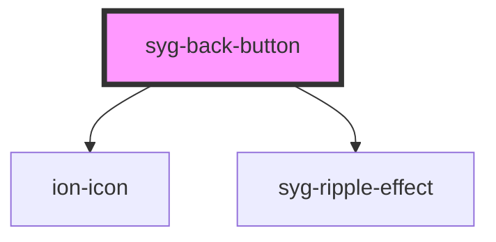

# syg-back-button

The back button navigates back in the app's history upon click. It is smart enough to know what to render based on the mode and when to show based on the navigation stack.

To change what is displayed in the back button, use the `text` and `icon` properties.


<!-- Auto Generated Below -->


## Usage

### Angular

```html
<!-- Default back button -->
<syg-header>
  <syg-toolbar>
    <syg-buttons slot="start">
      <syg-back-button></syg-back-button>
    </syg-buttons>
  </syg-toolbar>
</syg-header>

<!-- Back button with a default href -->
<syg-header>
  <syg-toolbar>
    <syg-buttons slot="start">
      <syg-back-button defaultHref="home"></syg-back-button>
    </syg-buttons>
  </syg-toolbar>
</syg-header>

<!-- Back button with custom text and icon -->
<syg-header>
  <syg-toolbar>
    <syg-buttons slot="start">
      <syg-back-button
          [text]="buttonText"
          [icon]="buttonIcon">
      </syg-back-button>
    </syg-buttons>
  </syg-toolbar>
</syg-header>

<!-- Back button with no text and custom icon -->
<syg-header>
  <syg-toolbar>
    <syg-buttons slot="start">
      <syg-back-button text="" icon="add"></syg-back-button>
    </syg-buttons>
  </syg-toolbar>
</syg-header>

<!-- Danger back button next to a menu button -->
<syg-header>
  <syg-toolbar>
    <syg-buttons slot="start">
      <syg-menu-button></syg-menu-button>
      <syg-back-button color="danger"></syg-back-button>
    </syg-buttons>
  </syg-toolbar>
</syg-header>
```


### Javascript

```html
<!-- Default back button -->
<syg-header>
  <syg-toolbar>
    <syg-buttons slot="start">
      <syg-back-button></syg-back-button>
    </syg-buttons>
  </syg-toolbar>
</syg-header>

<!-- Back button with a default href -->
<syg-header>
  <syg-toolbar>
    <syg-buttons slot="start">
      <syg-back-button default-href="home"></syg-back-button>
    </syg-buttons>
  </syg-toolbar>
</syg-header>

<!-- Back button with custom text and icon -->
<syg-header>
  <syg-toolbar>
    <syg-buttons slot="start">
      <syg-back-button text="Volver" icon="close"></syg-back-button>
    </syg-buttons>
  </syg-toolbar>
</syg-header>

<!-- Back button with no text and custom icon -->
<syg-header>
  <syg-toolbar>
    <syg-buttons slot="start">
      <syg-back-button text="" icon="add"></syg-back-button>
    </syg-buttons>
  </syg-toolbar>
</syg-header>

<!-- Danger back button next to a menu button -->
<syg-header>
  <syg-toolbar>
    <syg-buttons slot="start">
      <syg-menu-button></syg-menu-button>
      <syg-back-button color="danger"></syg-back-button>
    </syg-buttons>
  </syg-toolbar>
</syg-header>
```


### React

```tsx
import React from 'react';
import { IonBackButton, IonHeader, IonToolbar, IonButtons, IonMenuButton, IonContent } from '@ionic/react';

export const BackButtonExample: React.FC = () => (
  <IonContent>
    {/*-- Default back button --*/}
    <IonHeader>
      <IonToolbar>
        <IonButtons slot="start">
          <IonBackButton />
        </IonButtons>
      </IonToolbar>
    </IonHeader>

    {/*-- Back button with a default href --*/}
    <IonHeader>
      <IonToolbar>
        <IonButtons slot="start">
          <IonBackButton defaultHref="home" />
        </IonButtons>
      </IonToolbar>
    </IonHeader>

    {/*-- Back button with custom text and icon --*/}
    <IonHeader>
      <IonToolbar>
        <IonButtons slot="start">
          <IonBackButton text="buttonText" icon="buttonIcon" />
        </IonButtons>
      </IonToolbar>
    </IonHeader>

    {/*-- Back button with no text and custom icon --*/}
    <IonHeader>
      <IonToolbar>
        <IonButtons slot="start">
          <IonBackButton text="" icon="add" />
        </IonButtons>
      </IonToolbar>
    </IonHeader>

    {/*-- Danger back button next to a menu button --*/}
    <IonHeader>
      <IonToolbar>
        <IonButtons slot="start">
          <IonMenuButton />
          <IonBackButton color="danger" />
        </IonButtons>
      </IonToolbar>
    </IonHeader>
  </IonContent>
);
```


### Stencil

```tsx
import { Component, h } from '@stencil/core';

@Component({
  tag: 'back-button-example',
  styleUrl: 'back-button-example.css'
})
export class BackButtonExample {
  render() {
    const buttonText = "Custom";
    const buttonIcon = "add";

    return [
      // Default back button
      <syg-header>
        <syg-toolbar>
          <syg-buttons slot="start">
            <syg-back-button></syg-back-button>
          </syg-buttons>
        </syg-toolbar>
      </syg-header>,

      // Back button with a default href
      <syg-header>
        <syg-toolbar>
          <syg-buttons slot="start">
            <syg-back-button defaultHref="home"></syg-back-button>
          </syg-buttons>
        </syg-toolbar>
      </syg-header>,

      // Back button with custom text and icon
      <syg-header>
        <syg-toolbar>
          <syg-buttons slot="start">
            <syg-back-button
              text={buttonText}
              icon={buttonIcon}>
            </syg-back-button>
          </syg-buttons>
        </syg-toolbar>
      </syg-header>,

      // Back button with no text and custom icon
      <syg-header>
        <syg-toolbar>
          <syg-buttons slot="start">
            <syg-back-button text="" icon="add"></syg-back-button>
          </syg-buttons>
        </syg-toolbar>
      </syg-header>,

      // Danger back button next to a menu button
      <syg-header>
        <syg-toolbar>
          <syg-buttons slot="start">
            <syg-menu-button></syg-menu-button>
            <syg-back-button color="danger"></syg-back-button>
          </syg-buttons>
        </syg-toolbar>
      </syg-header>
    ];
  }
}
```


### Vue

```html
<template>
  <!-- Default back button -->
  <syg-header>
    <syg-toolbar>
      <syg-buttons slot="start">
        <syg-back-button></syg-back-button>
      </syg-buttons>
    </syg-toolbar>
  </syg-header>

  <!-- Back button with a default href -->
  <syg-header>
    <syg-toolbar>
      <syg-buttons slot="start">
        <syg-back-button default-href="home"></syg-back-button>
      </syg-buttons>
    </syg-toolbar>
  </syg-header>

  <!-- Back button with custom text and icon -->
  <syg-header>
    <syg-toolbar>
      <syg-buttons slot="start">
        <syg-back-button
            :text="buttonText"
            :icon="buttonIcon">
        </syg-back-button>
      </syg-buttons>
    </syg-toolbar>
  </syg-header>

  <!-- Back button with no text and custom icon -->
  <syg-header>
    <syg-toolbar>
      <syg-buttons slot="start">
        <syg-back-button text="" icon="add"></syg-back-button>
      </syg-buttons>
    </syg-toolbar>
  </syg-header>

  <!-- Danger back button next to a menu button -->
  <syg-header>
    <syg-toolbar>
      <syg-buttons slot="start">
        <syg-menu-button></syg-menu-button>
        <syg-back-button color="danger"></syg-back-button>
      </syg-buttons>
    </syg-toolbar>
  </syg-header>
</template>

<script>
import { IonButtons, IonHeader, IonMenuButton, IonToolbar } from '@ionic/vue';
import { defineComponent } from 'vue';

export default defineComponent({
  components: { IonButtons, IonHeader, IonMenuButton, IonToolbar }
});
</script>
```


## Properties

| Property          | Attribute      | Description                                                                                                                                                                                                                                                            | Type                                                    | Default     |
| ----------------- | -------------- | ---------------------------------------------------------------------------------------------------------------------------------------------------------------------------------------------------------------------------------------------------------------------- | ------------------------------------------------------- | ----------- |
| `color`           | `color`        | The color to use from your application's color palette. Default options are: `"primary"`, `"secondary"`, `"tertiary"`, `"success"`, `"warning"`, `"danger"`, `"light"`, `"medium"`, and `"dark"`. For more information on colors, see [theming](/docs/theming/basics). | `string \| undefined`                                   | `undefined` |
| `defaultHref`     | `default-href` | The url to navigate back to by default when there is no history.                                                                                                                                                                                                       | `string \| undefined`                                   | `undefined` |
| `disabled`        | `disabled`     | If `true`, the user cannot interact with the button.                                                                                                                                                                                                                   | `boolean`                                               | `false`     |
| `icon`            | `icon`         | The icon name to use for the back button.                                                                                                                                                                                                                              | `null \| string \| undefined`                           | `undefined` |
| `mode`            | `mode`         | The mode determines which platform styles to use.                                                                                                                                                                                                                      | `"ios" \| "md"`                                         | `undefined` |
| `routerAnimation` | --             | When using a router, it specifies the transition animation when navigating to another page.                                                                                                                                                                            | `((baseEl: any, opts?: any) => Animation) \| undefined` | `undefined` |
| `text`            | `text`         | The text to display in the back button.                                                                                                                                                                                                                                | `null \| string \| undefined`                           | `undefined` |
| `type`            | `type`         | The type of the button.                                                                                                                                                                                                                                                | `"button" \| "reset" \| "submit"`                       | `'button'`  |


## Shadow Parts

| Part       | Description                                                   |
| ---------- | ------------------------------------------------------------- |
| `"icon"`   | The back button icon (uses ion-icon).                         |
| `"native"` | The native HTML button element that wraps all child elements. |
| `"text"`   | The back button text.                                         |


## CSS Custom Properties

| Name                           | Description                                                                                                    |
| ------------------------------ | -------------------------------------------------------------------------------------------------------------- |
| `--background`                 | Background of the button                                                                                       |
| `--background-focused`         | Background of the button when focused with the tab key                                                         |
| `--background-focused-opacity` | Opacity of the button background when focused with the tab key                                                 |
| `--background-hover`           | Background of the button on hover                                                                              |
| `--background-hover-opacity`   | Opacity of the background on hover                                                                             |
| `--border-radius`              | Border radius of the button                                                                                    |
| `--color`                      | Text color of the button                                                                                       |
| `--color-focused`              | Text color of the button when focused with the tab key                                                         |
| `--color-hover`                | Text color of the button on hover                                                                              |
| `--icon-font-size`             | Font size of the button icon                                                                                   |
| `--icon-font-weight`           | Font weight of the button icon                                                                                 |
| `--icon-margin-bottom`         | Bottom margin of the button icon                                                                               |
| `--icon-margin-end`            | Right margin if direction is left-to-right, and left margin if direction is right-to-left of the button icon   |
| `--icon-margin-start`          | Left margin if direction is left-to-right, and right margin if direction is right-to-left of the button icon   |
| `--icon-margin-top`            | Top margin of the button icon                                                                                  |
| `--icon-padding-bottom`        | Bottom padding of the button icon                                                                              |
| `--icon-padding-end`           | Right padding if direction is left-to-right, and left padding if direction is right-to-left of the button icon |
| `--icon-padding-start`         | Left padding if direction is left-to-right, and right padding if direction is right-to-left of the button icon |
| `--icon-padding-top`           | Top padding of the button icon                                                                                 |
| `--margin-bottom`              | Bottom margin of the button                                                                                    |
| `--margin-end`                 | Right margin if direction is left-to-right, and left margin if direction is right-to-left of the button        |
| `--margin-start`               | Left margin if direction is left-to-right, and right margin if direction is right-to-left of the button        |
| `--margin-top`                 | Top margin of the button                                                                                       |
| `--min-height`                 | Minimum height of the button                                                                                   |
| `--min-width`                  | Minimum width of the button                                                                                    |
| `--opacity`                    | Opacity of the button                                                                                          |
| `--padding-bottom`             | Bottom padding of the button                                                                                   |
| `--padding-end`                | Right padding if direction is left-to-right, and left padding if direction is right-to-left of the button      |
| `--padding-start`              | Left padding if direction is left-to-right, and right padding if direction is right-to-left of the button      |
| `--padding-top`                | Top padding of the button                                                                                      |
| `--ripple-color`               | Color of the button ripple effect                                                                              |
| `--transition`                 | Transition of the button                                                                                       |


## Dependencies

### Depends on

- ion-icon
- [syg-ripple-effect](../ripple-effect)

### Graph


----------------------------------------------

*Built with [StencilJS](https://stenciljs.com/)*
