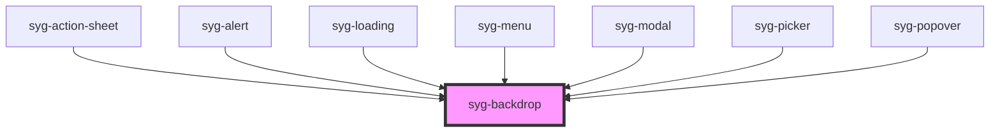

# syg-backdrop

Backdrops are full screen components that overlay other components. They are useful behind components that transition in on top of other content and can be used to dismiss that component.


<!-- Auto Generated Below -->


## Usage

### Angular

```html
<!-- Default backdrop -->
<syg-backdrop></syg-backdrop>

<!-- Backdrop that is not tappable -->
<syg-backdrop tappable="false"></syg-backdrop>

<!-- Backdrop that is not visible -->
<syg-backdrop visible="false"></syg-backdrop>

<!-- Backdrop with propagation -->
<syg-backdrop stopPropagation="false"></syg-backdrop>

<!-- Backdrop that sets dynamic properties -->
<syg-backdrop
  [tappable]="enableBackdropDismiss"
  [visible]="showBackdrop"
  [stopPropagation]="shouldPropagate">
</syg-backdrop>
```

```typescript
import { Component } from '@angular/core';

@Component({
  selector: 'backdrop-example',
  templateUrl: 'backdrop-example.html',
  styleUrls: ['./backdrop-example.css'],
})
export class BackdropExample {
  enableBackdropDismiss = false;
  showBackdrop = false;
  shouldPropagate = false;
}
```


### Javascript

```html
<!-- Default backdrop -->
<syg-backdrop></syg-backdrop>

<!-- Backdrop that is not tappable -->
<syg-backdrop tappable="false"></syg-backdrop>

<!-- Backdrop that is not visible -->
<syg-backdrop visible="false"></syg-backdrop>

<!-- Backdrop with propagation -->
<syg-backdrop stop-propagation="false"></syg-backdrop>

<!-- Backdrop that sets dynamic properties -->
<syg-backdrop id="customBackdrop"></syg-backdrop>
```

```javascript
var backdrop = document.getElementById('customBackdrop');
backdrop.visible = false;
backdrop.tappable = false;
backdrop.stopPropagation = false;
```


### React

```tsx
import React from 'react';
import { IonBackdrop, IonContent } from '@ionic/react';

export const BackdropExample: React.FC = () => (
  <IonContent>
    {/*-- Default backdrop --*/}
    <IonBackdrop />

    {/*-- Backdrop that is not tappable --*/}
    <IonBackdrop tappable={false} />

    {/*-- Backdrop that is not visible --*/}
    <IonBackdrop visible={false} />

    {/*-- Backdrop with propagation --*/}
    <IonBackdrop stopPropagation={false} />

    <IonBackdrop tappable={true} visible={true} stopPropagation={true} />
  </IonContent>
);
```


### Stencil

```tsx
import { Component, h } from '@stencil/core';

@Component({
  tag: 'backdrop-example',
  styleUrl: 'backdrop-example.css'
})
export class BackdropExample {
  render() {
    const enableBackdropDismiss = false;
    const showBackdrop = false;
    const shouldPropagate = false;

    return [
      // Default backdrop
      <syg-backdrop></syg-backdrop>,

      // Backdrop that is not tappable
      <syg-backdrop tappable={false}></syg-backdrop>,

      // Backdrop that is not visible
      <syg-backdrop visible={false}></syg-backdrop>,

      // Backdrop with propagation
      <syg-backdrop stopPropagation={false}></syg-backdrop>,

      // Backdrop that sets dynamic properties
      <syg-backdrop
        tappable={enableBackdropDismiss}
        visible={showBackdrop}
        stopPropagation={shouldPropagate}>
      </syg-backdrop>
    ];
  }
}
```


### Vue

```html
<template>
  <!-- Default backdrop -->
  <syg-backdrop></syg-backdrop>

  <!-- Backdrop that is not tappable -->
  <syg-backdrop tappable="false"></syg-backdrop>

  <!-- Backdrop that is not visible -->
  <syg-backdrop visible="false"></syg-backdrop>

  <!-- Backdrop with propagation -->
  <syg-backdrop stop-propagation="false"></syg-backdrop>

  <!-- Backdrop that sets dynamic properties -->
  <syg-backdrop
    :tappable="enableBackdropDismiss"
    :visible="showBackdrop"
    :stop-propagation="shouldPropagate">
  </syg-backdrop>
</template>

<script>
import { IonBackdrop } from '@ionic/vue';
import { defineComponent } from 'vue';

export default defineComponent({
  components: { IonBackdrop },
  setup() {
    return {
      enableBackdropDismiss: true,
      showBackdrop: true,
      shouldPropagate: true
    }
  }
});
</script>
```


## Properties

| Property          | Attribute          | Description                                                                           | Type      | Default |
| ----------------- | ------------------ | ------------------------------------------------------------------------------------- | --------- | ------- |
| `stopPropagation` | `stop-propagation` | If `true`, the backdrop will stop propagation on tap.                                 | `boolean` | `true`  |
| `tappable`        | `tappable`         | If `true`, the backdrop will can be clicked and will emit the `ionBackdropTap` event. | `boolean` | `true`  |
| `visible`         | `visible`          | If `true`, the backdrop will be visible.                                              | `boolean` | `true`  |


## Events

| Event            | Description                          | Type                |
| ---------------- | ------------------------------------ | ------------------- |
| `ionBackdropTap` | Emitted when the backdrop is tapped. | `CustomEvent<void>` |


## Dependencies

### Used by

 - [syg-action-sheet](../action-sheet)
 - [syg-alert](../alert)
 - [syg-loading](../loading)
 - [syg-menu](../menu)
 - [syg-modal](../modal)
 - [syg-picker](../picker)
 - [syg-popover](../popover)

### Graph


----------------------------------------------

*Built with [StencilJS](https://stenciljs.com/)*
