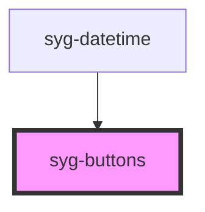

# syg-buttons

The Buttons component is a container element. Buttons placed in a toolbar should be placed inside of the `<syg-buttons>` element.

The `<syg-buttons>` element can be positioned inside of the toolbar using a named slot. The below chart has a description of each slot.

| Slot         | Description                                                                                              |
|--------------|----------------------------------------------------------------------------------------------------------|
| `secondary`  | Positions element to the `left` of the content in `ios` mode, and directly to the `right` in `md` mode.  |
| `primary`    | Positions element to the `right` of the content in `ios` mode, and to the far `right` in `md` mode.      |
| `start`      | Positions to the `left` of the content in LTR, and to the `right` in RTL.                                |
| `end`        | Positions to the `right` of the content in LTR, and to the `left` in RTL.                                |


<!-- Auto Generated Below -->


## Usage

### Angular

```html
<syg-toolbar>
  <syg-buttons slot="start">
    <syg-back-button></syg-back-button>
  </syg-buttons>
  <syg-title>Back Button</syg-title>
</syg-toolbar>

<syg-toolbar>
  <syg-buttons slot="secondary">
    <syg-button>
      <ion-icon slot="icon-only" name="person-circle"></ion-icon>
    </syg-button>
    <syg-button>
      <ion-icon slot="icon-only" name="search"></ion-icon>
    </syg-button>
  </syg-buttons>
  <syg-title>Default Buttons</syg-title>
  <syg-buttons slot="primary">
    <syg-button color="secondary">
      <ion-icon slot="icon-only" ios="ellipsis-horizontal" md="ellipsis-vertical"></ion-icon>
    </syg-button>
  </syg-buttons>
</syg-toolbar>

<syg-toolbar>
  <syg-buttons slot="primary">
    <syg-button (click)="clickedStar()">
      <ion-icon slot="icon-only" name="star"></ion-icon>
    </syg-button>
  </syg-buttons>
  <syg-title>Right side menu toggle</syg-title>
  <syg-buttons slot="end">
    <syg-menu-button autoHide="false"></syg-menu-button>
  </syg-buttons>
</syg-toolbar>

<syg-toolbar>
  <syg-buttons collapse="true">
    <syg-button>
      <ion-icon slot="icon-only" name="star"></ion-icon>
    </syg-button>
  </syg-buttons>
  <syg-title>Collapsible Buttons</syg-title>
</syg-toolbar>
```


### Javascript

```html
<syg-toolbar>
  <syg-buttons slot="start">
    <syg-back-button></syg-back-button>
  </syg-buttons>
  <syg-title>Back Button</syg-title>
</syg-toolbar>

<syg-toolbar>
  <syg-buttons slot="secondary">
    <syg-button>
      <ion-icon slot="icon-only" name="person-circle"></ion-icon>
    </syg-button>
    <syg-button>
      <ion-icon slot="icon-only" name="search"></ion-icon>
    </syg-button>
  </syg-buttons>
  <syg-title>Default Buttons</syg-title>
  <syg-buttons slot="primary">
    <syg-button color="secondary">
      <ion-icon slot="icon-only" ios="ellipsis-horizontal" md="ellipsis-vertical"></ion-icon>
    </syg-button>
  </syg-buttons>
</syg-toolbar>

<syg-toolbar>
  <syg-buttons slot="primary">
    <syg-button onclick="clickedStar()">
      <ion-icon slot="icon-only" name="star"></ion-icon>
    </syg-button>
  </syg-buttons>
  <syg-title>Right side menu toggle</syg-title>
  <syg-buttons slot="end">
    <syg-menu-toggle auto-hide="false">
      <syg-button>
        <ion-icon slot="icon-only" name="menu"></ion-icon>
      </syg-button>
    </syg-menu-toggle>
  </syg-buttons>
</syg-toolbar>

<syg-toolbar>
  <syg-buttons collapse="true">
    <syg-button>
      <ion-icon slot="icon-only" name="star"></ion-icon>
    </syg-button>
  </syg-buttons>
  <syg-title>Collapsible Buttons</syg-title>
</syg-toolbar>
```


### React

```tsx
import React from 'react';
import { IonButtons, IonToolbar, IonBackButton, IonTitle, IonButton, IonIcon, IonMenuButton, IonContent } from '@ionic/react';
import { personCircle, search, star, ellipsisHorizontal, ellipsisVertical } from 'ionicons/icons';

export const ButtonsExample: React.FC = () => (
  <IonContent>
    <IonToolbar>
      <IonButtons slot="start">
        <IonBackButton defaultHref="/" />
      </IonButtons>
      <IonTitle>Back Button</IonTitle>
    </IonToolbar>

    <IonToolbar>
      <IonButtons slot="secondary">
        <IonButton>
          <IonIcon slot="icon-only" icon={personCircle} />
        </IonButton>
        <IonButton>
          <IonIcon slot="icon-only" icon={search} />
        </IonButton>
      </IonButtons>
      <IonTitle>Default Buttons</IonTitle>
      <IonButtons slot="primary">
        <IonButton color="secondary">
          <IonIcon slot="icon-only" ios={ellipsisHorizontal} md={ellipsisVertical} />
        </IonButton>
      </IonButtons>
    </IonToolbar>

    <IonToolbar>
      <IonButtons slot="primary">
        <IonButton onClick={() => {}}>
          <IonIcon slot="icon-only" icon={star} />
        </IonButton>
      </IonButtons>
      <IonTitle>Right side menu toggle</IonTitle>
      <IonButtons slot="end">
        <IonMenuButton autoHide={false} />
      </IonButtons>
    </IonToolbar>

    <IonToolbar>
      <IonButtons collapse="true">
        <IonButton>
          <IonIcon slot="icon-only" icon={star} />
        </IonButton>
      </IonButtons>
      <IonTitle>Collapsible Buttons</IonTitle>
    </IonToolbar>
  </IonContent>
);
```


### Stencil

```tsx
import { Component, h } from '@stencil/core';

@Component({
  tag: 'buttons-example',
  styleUrl: 'buttons-example.css'
})
export class ButtonsExample {

  clickedStar() {
    console.log("Clicked star button");
  }

  render() {
    return [
      <syg-toolbar>
        <syg-buttons slot="start">
          <syg-back-button></syg-back-button>
        </syg-buttons>
        <syg-title>Back Button</syg-title>
      </syg-toolbar>,

      <syg-toolbar>
        <syg-buttons slot="secondary">
          <syg-button>
            <ion-icon slot="icon-only" name="person-circle"></ion-icon>
          </syg-button>
          <syg-button>
            <ion-icon slot="icon-only" name="search"></ion-icon>
          </syg-button>
        </syg-buttons>
        <syg-title>Default Buttons</syg-title>
        <syg-buttons slot="primary">
          <syg-button color="secondary">
            <ion-icon slot="icon-only" ios="ellipsis-horizontal" md="ellipsis-vertical"></ion-icon>
          </syg-button>
        </syg-buttons>
      </syg-toolbar>,

      <syg-toolbar>
        <syg-buttons slot="primary">
          <syg-button onClick={() => this.clickedStar()}>
            <ion-icon slot="icon-only" name="star"></ion-icon>
          </syg-button>
        </syg-buttons>
        <syg-title>Right side menu toggle</syg-title>
        <syg-buttons slot="end">
          <syg-menu-button autoHide={false}></syg-menu-button>
        </syg-buttons>
      </syg-toolbar>,

      <syg-toolbar>
        <syg-buttons collapse={true}>
          <syg-button>
            <ion-icon slot="icon-only" name="star"></ion-icon>
          </syg-button>
        </syg-buttons>
        <syg-title>Collapsible Buttons</syg-title>
      </syg-toolbar>
    ];
  }
}
```


### Vue

```html
<template>
  <syg-toolbar>
    <syg-buttons slot="start">
      <syg-back-button></syg-back-button>
    </syg-buttons>
    <syg-title>Back Button</syg-title>
  </syg-toolbar>

  <syg-toolbar>
    <syg-buttons slot="secondary">
      <syg-button>
        <ion-icon slot="icon-only" :icon="personCircle"></ion-icon>
      </syg-button>
      <syg-button>
        <ion-icon slot="icon-only" :icon="search"></ion-icon>
      </syg-button>
    </syg-buttons>
    <syg-title>Default Buttons</syg-title>
    <syg-buttons slot="primary">
      <syg-button color="secondary">
        <ion-icon slot="icon-only" ios="ellipsis-horizontal" md="ellipsis-vertical"></ion-icon>
      </syg-button>
    </syg-buttons>
  </syg-toolbar>

  <syg-toolbar>
    <syg-buttons slot="primary">
      <syg-button @click="clickedStar()">
        <ion-icon slot="icon-only" name="star"></ion-icon>
      </syg-button>
    </syg-buttons>
    <syg-title>Right side menu toggle</syg-title>
    <syg-buttons slot="end">
      <syg-menu-button auto-hide="false"></syg-menu-button>
    </syg-buttons>
  </syg-toolbar>

  <syg-toolbar>
    <syg-buttons collapse="true">
      <syg-button>
        <ion-icon slot="icon-only" name="star"></ion-icon>
      </syg-button>
    </syg-buttons>
    <syg-title>Collapsible Buttons</syg-title>
  </syg-toolbar>
</template>

<script>
import { IonBackButton, IonButton, IonButtons, IonIcon, IonMenuButton, IonTitle, IonToolbar } from '@ionic/vue';
import { personCircle, search } from 'ionicons/icons';
import { defineComponent } from 'vue';

export default defineComponent({
  components: { IonBackButton, IonButton, IonButtons, IonIcon, IonMenuButton, IonTitle, IonToolbar },
  setup() {
    const clickedStar = () => {
      console.log('Star clicked!');
    }
    return { personCircle, search, clickedStar };
  }
});
</script>
```


## Properties

| Property   | Attribute  | Description                                                                                                                                                                                                                                                                                                                                                                                                                                       | Type      | Default |
| ---------- | ---------- | ------------------------------------------------------------------------------------------------------------------------------------------------------------------------------------------------------------------------------------------------------------------------------------------------------------------------------------------------------------------------------------------------------------------------------------------------- | --------- | ------- |
| `collapse` | `collapse` | If true, buttons will disappear when its parent toolbar has fully collapsed if the toolbar is not the first toolbar. If the toolbar is the first toolbar, the buttons will be hidden and will only be shown once all toolbars have fully collapsed.  Only applies in `ios` mode with `collapse` set to `true` on `syg-header`.  Typically used for [Collapsible Large Titles](https://ionicframework.com/docs/api/title#collapsible-large-titles) | `boolean` | `false` |


## Dependencies

### Used by

 - [syg-datetime](../datetime)

### Graph


----------------------------------------------

*Built with [StencilJS](https://stenciljs.com/)*
