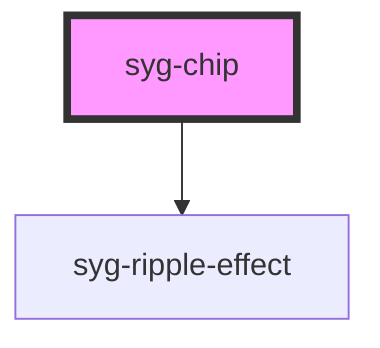

# syg-chip

Chips represent complex entities in small blocks, such as a contact. A chip can contain several different elements such as avatars, text, and icons.

<!-- Auto Generated Below -->


## Usage

### Angular

```html
<syg-chip>
  <syg-label>Default</syg-label>
</syg-chip>

<syg-chip>
  <syg-label color="secondary">Secondary Label</syg-label>
</syg-chip>

<syg-chip color="secondary">
  <syg-label color="dark">Secondary w/ Dark label</syg-label>
</syg-chip>

<syg-chip [disabled]="true">
  <syg-label>Disabled Chip</syg-label>
</syg-chip>

<syg-chip>
  <ion-icon name="pin"></ion-icon>
  <syg-label>Default</syg-label>
</syg-chip>

<syg-chip>
  <ion-icon name="heart" color="dark"></ion-icon>
  <syg-label>Default</syg-label>
</syg-chip>

<syg-chip>
  <syg-label>Button Chip</syg-label>
  <ion-icon name="close-circle"></ion-icon>
</syg-chip>

<syg-chip>
  <ion-icon name="pin" color="primary"></ion-icon>
  <syg-label>Icon Chip</syg-label>
  <ion-icon name="close"></ion-icon>
</syg-chip>

<syg-chip>
  <syg-avatar>
    
  </syg-avatar>
  <syg-label>Avatar Chip</syg-label>
  <ion-icon name="close-circle"></ion-icon>
</syg-chip>
```


### Javascript

```html
<syg-chip>
  <syg-label>Default</syg-label>
</syg-chip>

<syg-chip>
  <syg-label color="secondary">Secondary Label</syg-label>
</syg-chip>

<syg-chip color="secondary">
  <syg-label color="dark">Secondary w/ Dark label</syg-label>
</syg-chip>

<syg-chip disabled="true">
  <syg-label>Disabled Chip</syg-label>
</syg-chip>

<syg-chip>
  <ion-icon name="pin"></ion-icon>
  <syg-label>Default</syg-label>
</syg-chip>

<syg-chip>
  <ion-icon name="heart" color="dark"></ion-icon>
  <syg-label>Default</syg-label>
</syg-chip>

<syg-chip>
  <syg-label>Button Chip</syg-label>
  <ion-icon name="close-circle"></ion-icon>
</syg-chip>

<syg-chip>
  <ion-icon name="pin" color="primary"></ion-icon>
  <syg-label>Icon Chip</syg-label>
  <ion-icon name="close"></ion-icon>
</syg-chip>

<syg-chip>
  <syg-avatar>
    
  </syg-avatar>
  <syg-label>Avatar Chip</syg-label>
  <ion-icon name="close-circle"></ion-icon>
</syg-chip>
```


### React

```tsx
import React from 'react';
import { IonContent, IonHeader, IonPage, IonTitle, IonToolbar, IonChip, IonLabel, IonIcon, IonAvatar } from '@ionic/react';
import { pin, heart, closeCircle, close } from 'ionicons/icons';

export const ChipExamples: React.FC = () => {
  return (
    <IonPage>
      <IonHeader>
        <IonToolbar>
          <IonTitle>ChipExamples</IonTitle>
        </IonToolbar>
      </IonHeader>
      <IonContent>
        <IonChip>
          <IonLabel>Default</IonLabel>
        </IonChip>

        <IonChip>
          <IonLabel color="secondary">Secondary Label</IonLabel>
        </IonChip>

        <IonChip color="secondary">
          <IonLabel color="dark">Secondary w/ Dark label</IonLabel>
        </IonChip>

        <IonChip disabled={true}>
          <IonLabel>Disabled Chip</IonLabel>
        </IonChip>

        <IonChip>
          <IonIcon icon={pin} />
          <IonLabel>Default</IonLabel>
        </IonChip>

        <IonChip>
          <IonIcon icon={heart} color="dark" />
          <IonLabel>Default</IonLabel>
        </IonChip>

        <IonChip>
          <IonLabel>Button Chip</IonLabel>
          <IonIcon icon={closeCircle} />
        </IonChip>

        <IonChip>
          <IonIcon icon={pin} color="primary" />
          <IonLabel>Icon Chip</IonLabel>
          <IonIcon icon={close} />
        </IonChip>

        <IonChip>
          <IonAvatar>
            
          </IonAvatar>
          <IonLabel>Avatar Chip</IonLabel>
          <IonIcon icon={closeCircle} />
        </IonChip>
      </IonContent>
    </IonPage>
  );
};

```


### Stencil

```tsx
import { Component, h } from '@stencil/core';

@Component({
  tag: 'chip-example',
  styleUrl: 'chip-example.css'
})
export class ChipExample {
  render() {
    return [
      <syg-chip>
        <syg-label>Default</syg-label>
      </syg-chip>,

      <syg-chip>
        <syg-label color="secondary">Secondary Label</syg-label>
      </syg-chip>,

      <syg-chip color="secondary">
        <syg-label color="dark">Secondary w/ Dark label</syg-label>
      </syg-chip>,

      <syg-chip>
        <ion-icon name="pin"></ion-icon>
        <syg-label>Default</syg-label>
      </syg-chip>,

      <syg-chip>
        <ion-icon name="heart" color="dark"></ion-icon>
        <syg-label>Default</syg-label>
      </syg-chip>,

      <syg-chip>
        <syg-label>Button Chip</syg-label>
        <ion-icon name="close-circle"></ion-icon>
      </syg-chip>,

      <syg-chip>
        <ion-icon name="pin" color="primary"></ion-icon>
        <syg-label>Icon Chip</syg-label>
        <ion-icon name="close"></ion-icon>
      </syg-chip>,

      <syg-chip>
        <syg-avatar>
          
        </syg-avatar>
        <syg-label>Avatar Chip</syg-label>
        <ion-icon name="close-circle"></ion-icon>
      </syg-chip>
    ];
  }
}
```


### Vue

```html
<template>
  <syg-chip>
    <syg-label>Default</syg-label>
  </syg-chip>

  <syg-chip>
    <syg-label color="secondary">Secondary Label</syg-label>
  </syg-chip>

  <syg-chip color="secondary">
    <syg-label color="dark">Secondary w/ Dark label</syg-label>
  </syg-chip>

  <syg-chip :disabled="true">
    <syg-label>Disabled Chip</syg-label>
  </syg-chip>

  <syg-chip>
    <ion-icon :icon="pin"></ion-icon>
    <syg-label>Default</syg-label>
  </syg-chip>

  <syg-chip>
    <ion-icon :icon="heart" color="dark"></ion-icon>
    <syg-label>Default</syg-label>
  </syg-chip>

  <syg-chip>
    <syg-label>Button Chip</syg-label>
    <ion-icon :icon="closeCircle"></ion-icon>
  </syg-chip>

  <syg-chip>
    <ion-icon :icon="pin" color="primary"></ion-icon>
    <syg-label>Icon Chip</syg-label>
    <ion-icon :icon="close"></ion-icon>
  </syg-chip>

  <syg-chip>
    <syg-avatar>
      
    </syg-avatar>
    <syg-label>Avatar Chip</syg-label>
    <ion-icon :icon="closeCircle"></ion-icon>
  </syg-chip>
</template>

<script>
import { IonAvatar, IonChip, IonIcon, IonLabel } from '@ionic/vue';
import { close, closeCircle, heart, pin } from 'ionicons/icons';

import { defineComponent } from 'vue';

export default defineComponent({
  components: { IonAvatar, IonChip, IonIcon, IonLabel },
  setup() {
    return { close, closeCircle, heart, pin }
  }
});
</script>
```


## Properties

| Property   | Attribute  | Description                                                                                                                                                                                                                                                            | Type                  | Default     |
| ---------- | ---------- | ---------------------------------------------------------------------------------------------------------------------------------------------------------------------------------------------------------------------------------------------------------------------- | --------------------- | ----------- |
| `color`    | `color`    | The color to use from your application's color palette. Default options are: `"primary"`, `"secondary"`, `"tertiary"`, `"success"`, `"warning"`, `"danger"`, `"light"`, `"medium"`, and `"dark"`. For more information on colors, see [theming](/docs/theming/basics). | `string \| undefined` | `undefined` |
| `disabled` | `disabled` | If `true`, the user cannot interact with the chip.                                                                                                                                                                                                                     | `boolean`             | `false`     |
| `mode`     | `mode`     | The mode determines which platform styles to use.                                                                                                                                                                                                                      | `"ios" \| "md"`       | `undefined` |
| `outline`  | `outline`  | Display an outline style button.                                                                                                                                                                                                                                       | `boolean`             | `false`     |


## CSS Custom Properties

| Name           | Description            |
| -------------- | ---------------------- |
| `--background` | Background of the chip |
| `--color`      | Color of the chip      |


## Dependencies

### Depends on

- [syg-ripple-effect](../ripple-effect)

### Graph


----------------------------------------------

*Built with [StencilJS](https://stenciljs.com/)*
