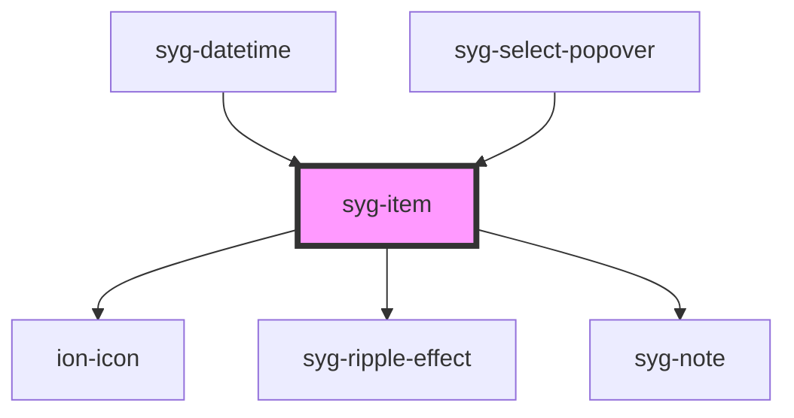

# syg-item

Items are elements that can contain text, icons, avatars, images, inputs, and any other native or custom elements. Generally they are placed in a list with other items. Items can be swiped, deleted, reordered, edited, and more.

## Clickable Items

An item is considered "clickable" if it has an `href` or `button` property set. Clickable items have a few visual differences that indicate they can be interacted with. For example, a clickable item receives the ripple effect upon activation in `md` mode, has a highlight when activated in `ios` mode, and has a [detail arrow](#detail-arrows) by default in `ios` mode.

## Detail Arrows

By default [clickable items](#clickable-items) will display a right arrow icon on `ios` mode. To hide the right arrow icon on clickable elements, set the `detail` property to `false`. To show the right arrow icon on an item that doesn't display it naturally, set the `detail` property to `true`.

<!--

TODO add this functionality back as a css variable

This feature is not enabled by default on clickable items for the `md` mode, but it can be enabled by setting the following CSS variable:

```css
--item-detail-push-show: true;
```

See the [theming documentation](/docs/theming/css-variables) for more information.

-->


## Item Placement

Item uses named [slots](https://developer.mozilla.org/en-US/docs/Web/HTML/Element/slot) in order to position content. This logic makes it possible to write a complex item with simple, understandable markup without having to worry about styling and positioning the elements.

The below chart details the item slots and where it will place the element inside of the item:

| Slot    | Description                                                                 |
|---------|-----------------------------------------------------------------------------|
| `start` | Placed to the left of all other content in LTR, and to the `right` in RTL.  |
| `end`   | Placed to the right of all other content in LTR, and to the `left` in RTL.  |
| none    | Placed inside of the input wrapper.                                         |


### Text Alignment

Items left align text and add an ellipsis when the text is wider than the item. See the [CSS Utilities Documentation](/docs/layout/css-utilities) for classes that can be added to `<syg-item>` to transform the text.


## Input Highlight

### Highlight Height

Items containing an input will highlight the bottom border of the input with a different color when focused, valid, or invalid. By default, `md` items have a highlight with a height set to `2px` and `ios` has no highlight (technically the height is set to `0`). The height can be changed using the `--highlight-height` CSS property. To turn off the highlight, set this variable to `0`. For more information on setting CSS properties, see the [theming documentation](/docs/theming/css-variables).

### Highlight Color

The highlight color changes based on the item state, but all of the states use Ionic colors by default. When focused, the input highlight will use the `primary` color. If the input is valid it will use the `success` color, and invalid inputs will use the `danger` color. See the [CSS Custom Properties](#css-custom-properties) section below for the highlight color variables.


<!-- Auto Generated Below -->


## Usage

### Angular

```html
<!-- Default Item -->
<syg-item>
  <syg-label>
    Item
  </syg-label>
</syg-item>

<!-- Item as a Button -->
<syg-item button (click)="buttonClick()">
  <syg-label>
    Button Item
  </syg-label>
</syg-item>

<!-- Item as an Anchor -->
<syg-item href="https://www.ionicframework.com">
  <syg-label>
    Anchor Item
  </syg-label>
</syg-item>

<syg-item color="secondary">
  <syg-label>
    Secondary Color Item
  </syg-label>
</syg-item>
```

### Detail Arrows

```html
<syg-item detail>
  <syg-label>
    Standard Item with Detail Arrow
  </syg-label>
</syg-item>

<syg-item button (click)="buttonClick()" detail>
  <syg-label>
    Button Item with Detail Arrow
  </syg-label>
</syg-item>

<syg-item detail="false" href="https://www.ionicframework.com">
  <syg-label>
    Anchor Item with no Detail Arrow
  </syg-label>
</syg-item>
```

### List Items

```html
<syg-list>
  <syg-item>
    <syg-label>
      Item
    </syg-label>
  </syg-item>

  <syg-item lines="none">
    <syg-label>
      No Lines Item
    </syg-label>
  </syg-item>

  <syg-item>
    <syg-label class="syg-text-wrap">
    Multiline text that should wrap when it is too long
    to fit on one line in the item.
    </syg-label>
  </syg-item>

  <syg-item>
    <syg-label class="syg-text-wrap">
      <syg-text color="primary">
        <h3>H3 Primary Title</h3>
      </syg-text>
      <p>Paragraph line 1</p>
      <syg-text color="secondary">
        <p>Paragraph line 2 secondary</p>
      </syg-text>
    </syg-label>
  </syg-item>

  <syg-item lines="full">
    <syg-label>
      Item with Full Lines
    </syg-label>
  </syg-item>

</syg-list>
```

### Item Lines

```html
<!-- Item Inset Lines -->
<syg-item lines="inset">
  <syg-label>Item Lines Inset</syg-label>
</syg-item>

<!-- Item Full Lines -->
<syg-item lines="full">
  <syg-label>Item Lines Full</syg-label>
</syg-item>

<!-- Item None Lines -->
<syg-item lines="none">
  <syg-label>Item Lines None</syg-label>
</syg-item>

<!-- List Full Lines -->
<syg-list lines="full">
  <syg-item>
    <syg-label>Full Lines Item 1</syg-label>
  </syg-item>

  <syg-item>
    <syg-label>Full Lines Item 2</syg-label>
  </syg-item>
</syg-list>

<!-- List Inset Lines -->
<syg-list lines="inset">
  <syg-item>
    <syg-label>Inset Lines Item 1</syg-label>
  </syg-item>

  <syg-item>
    <syg-label>Inset Lines Item 2</syg-label>
  </syg-item>
</syg-list>

<!-- List No Lines -->
<syg-list lines="none">
  <syg-item>
    <syg-label>No lines Item 1</syg-label>
  </syg-item>

  <syg-item>
    <syg-label>No lines Item 2</syg-label>
  </syg-item>

  <syg-item>
    <syg-label>No lines Item 3</syg-label>
  </syg-item>
</syg-list>
```


### Media Items

```html
<syg-item button (click)="testClick()">
  <syg-avatar slot="start">
    
  </syg-avatar>
  <syg-label>
    Avatar Start, Button Item
  </syg-label>
</syg-item>

<syg-item href="#">
  <syg-label>
    Thumbnail End, Anchor Item
  </syg-label>
  <syg-thumbnail slot="end">
    
  </syg-thumbnail>
</syg-item>

<syg-item>
  <syg-thumbnail slot="start">
    
  </syg-thumbnail>
  <syg-label>
    <h2>H2 Title Text</h2>
    <p>Button on right</p>
  </syg-label>
  <syg-button fill="outline" slot="end">View</syg-button>
</syg-item>

<syg-item button (click)="testClick()">
  <syg-thumbnail slot="start">
    
  </syg-thumbnail>
  <syg-label>
    <h3>H3 Title Text</h3>
    <p>Icon on right</p>
  </syg-label>
  <ion-icon name="close-circle" slot="end"></ion-icon>
</syg-item>
```

### Buttons in Items

```html
<syg-item>
  <syg-button slot="start">
    Start
  </syg-button>
  <syg-label>Button Start/End</syg-label>
  <syg-button slot="end">
    End
  </syg-button>
</syg-item>

<syg-item>
  <syg-button slot="start">
    Start Icon
    <ion-icon name="home" slot="end"></ion-icon>
  </syg-button>
  <syg-label>Buttons with Icons</syg-label>
  <syg-button slot="end">
    <ion-icon name="star" slot="end"></ion-icon>
    End Icon
  </syg-button>
</syg-item>

<syg-item>
  <syg-button slot="start">
    <ion-icon slot="icon-only" name="navigate"></ion-icon>
  </syg-button>
  <syg-label>Icon only Buttons</syg-label>
  <syg-button slot="end">
    <ion-icon slot="icon-only" name="star"></ion-icon>
  </syg-button>
</syg-item>
```

### Icons in Items

```html
<syg-item>
  <syg-label>
    Icon End
  </syg-label>
  <ion-icon name="informatsyg-circle" slot="end"></ion-icon>
</syg-item>

<syg-item>
  <syg-label>
    Large Icon End
  </syg-label>
  <ion-icon name="informatsyg-circle" size="large" slot="end"></ion-icon>
</syg-item>

<syg-item>
  <syg-label>
    Small Icon End
  </syg-label>
  <ion-icon name="informatsyg-circle" size="small" slot="end"></ion-icon>
</syg-item>

<syg-item>
  <ion-icon name="star" slot="start"></ion-icon>
  <syg-label>
    Icon Start
  </syg-label>
</syg-item>

<syg-item>
  <syg-label>
    Two Icons End
  </syg-label>
  <ion-icon name="checkmark-circle" slot="end"></ion-icon>
  <ion-icon name="shuffle" slot="end"></ion-icon>
</syg-item>
```

### Item Inputs

```html
<syg-item>
  <syg-label position="floating">Datetime</syg-label>
  <syg-datetime></syg-datetime>
</syg-item>

<syg-item>
  <syg-label position="floating">Select</syg-label>
  <syg-select>
    <syg-select-option value="">No Game Console</syg-select-option>
    <syg-select-option value="nes">NES</syg-select-option>
    <syg-select-option value="n64" selected>Nintendo64</syg-select-option>
    <syg-select-option value="ps">PlayStation</syg-select-option>
    <syg-select-option value="genesis">Sega Genesis</syg-select-option>
    <syg-select-option value="saturn">Sega Saturn</syg-select-option>
    <syg-select-option value="snes">SNES</syg-select-option>
  </syg-select>
</syg-item>

<syg-item>
  <syg-label>Toggle</syg-label>
  <syg-toggle slot="end"></syg-toggle>
</syg-item>

<syg-item>
  <syg-label position="floating">Floating Input</syg-label>
  <syg-input></syg-input>
</syg-item>

<syg-item>
  <syg-label>Input (placeholder)</syg-label>
  <syg-input placeholder="Placeholder"></syg-input>
</syg-item>

<syg-item fill="solid">
  <syg-label position="floating">Input (Fill: Solid)</syg-label>
  <syg-input></syg-input>
</syg-item>

<syg-item fill="outline">
  <syg-label position="floating">Input (Fill: Outline)</syg-label>
  <syg-input></syg-input>
</syg-item>

<syg-item>
  <syg-label>Helper and Error Text</syg-label>
  <syg-input></syg-input>
  <syg-note slot="helper">Helper Text</syg-note>
  <syg-note slot="error">Error Text</syg-note>
</syg-item>

<syg-item>
  <syg-label>Checkbox</syg-label>
  <syg-checkbox slot="start"></syg-checkbox>
</syg-item>

<syg-item>
  <syg-label>Range</syg-label>
  <syg-range></syg-range>
</syg-item>
```


### Javascript

```html
<!-- Default Item -->
<syg-item>
  <syg-label>
    Item
  </syg-label>
</syg-item>

<!-- Item as a Button -->
<syg-item button onclick="buttonClick()">
  <syg-label>
    Button Item
  </syg-label>
</syg-item>

<!-- Item as an Anchor -->
<syg-item href="https://www.ionicframework.com">
  <syg-label>
    Anchor Item
  </syg-label>
</syg-item>

<syg-item color="secondary">
  <syg-label>
    Secondary Color Item
  </syg-label>
</syg-item>
```

### Detail Arrows

```html
<syg-item detail>
  <syg-label>
    Standard Item with Detail Arrow
  </syg-label>
</syg-item>

<syg-item button onclick="buttonClick()" detail>
  <syg-label>
    Button Item with Detail Arrow
  </syg-label>
</syg-item>

<syg-item detail="false" href="https://www.ionicframework.com">
  <syg-label>
    Anchor Item with no Detail Arrow
  </syg-label>
</syg-item>
```

### List Items

```html
<syg-list>
  <syg-item>
    <syg-label>
      Item
    </syg-label>
  </syg-item>

  <syg-item lines="none">
    <syg-label>
      No Lines Item
    </syg-label>
  </syg-item>

  <syg-item>
    <syg-label class="syg-text-wrap">
    Multiline text that should wrap when it is too long
    to fit on one line in the item.
    </syg-label>
  </syg-item>

  <syg-item>
    <syg-label class="syg-text-wrap">
      <syg-text color="primary">
        <h3>H3 Primary Title</h3>
      </syg-text>
      <p>Paragraph line 1</p>
      <syg-text color="secondary">
        <p>Paragraph line 2 secondary</p>
      </syg-text>
    </syg-label>
  </syg-item>

  <syg-item lines="full">
    <syg-label>
      Item with Full Lines
    </syg-label>
  </syg-item>

</syg-list>
```

### Item Lines

```html
<!-- Item Inset Lines -->
<syg-item lines="inset">
  <syg-label>Item Lines Inset</syg-label>
</syg-item>

<!-- Item Full Lines -->
<syg-item lines="full">
  <syg-label>Item Lines Full</syg-label>
</syg-item>

<!-- Item None Lines -->
<syg-item lines="none">
  <syg-label>Item Lines None</syg-label>
</syg-item>

<!-- List Full Lines -->
<syg-list lines="full">
  <syg-item>
    <syg-label>Full Lines Item 1</syg-label>
  </syg-item>

  <syg-item>
    <syg-label>Full Lines Item 2</syg-label>
  </syg-item>
</syg-list>

<!-- List Inset Lines -->
<syg-list lines="inset">
  <syg-item>
    <syg-label>Inset Lines Item 1</syg-label>
  </syg-item>

  <syg-item>
    <syg-label>Inset Lines Item 2</syg-label>
  </syg-item>
</syg-list>

<!-- List No Lines -->
<syg-list lines="none">
  <syg-item>
    <syg-label>No lines Item 1</syg-label>
  </syg-item>

  <syg-item>
    <syg-label>No lines Item 2</syg-label>
  </syg-item>

  <syg-item>
    <syg-label>No lines Item 3</syg-label>
  </syg-item>
</syg-list>
```


### Media Items

```html
<syg-item button onclick="testClick()">
  <syg-avatar slot="start">
    
  </syg-avatar>
  <syg-label>
    Avatar Start, Button Item
  </syg-label>
</syg-item>

<syg-item href="#">
  <syg-label>
    Thumbnail End, Anchor Item
  </syg-label>
  <syg-thumbnail slot="end">
    
  </syg-thumbnail>
</syg-item>

<syg-item>
  <syg-thumbnail slot="start">
    
  </syg-thumbnail>
  <syg-label>
    <h2>H2 Title Text</h2>
    <p>Button on right</p>
  </syg-label>
  <syg-button fill="outline" slot="end">View</syg-button>
</syg-item>

<syg-item button onclick="testClick()">
  <syg-thumbnail slot="start">
    
  </syg-thumbnail>
  <syg-label>
    <h3>H3 Title Text</h3>
    <p>Icon on right</p>
  </syg-label>
  <ion-icon name="close-circle" slot="end"></ion-icon>
</syg-item>
```

### Buttons in Items

```html
<syg-item>
  <syg-button slot="start">
    Start
  </syg-button>
  <syg-label>Button Start/End</syg-label>
  <syg-button slot="end">
    End
  </syg-button>
</syg-item>

<syg-item>
  <syg-button slot="start">
    Start Icon
    <ion-icon name="home" slot="end"></ion-icon>
  </syg-button>
  <syg-label>Buttons with Icons</syg-label>
  <syg-button slot="end">
    <ion-icon name="star" slot="end"></ion-icon>
    End Icon
  </syg-button>
</syg-item>

<syg-item>
  <syg-button slot="start">
    <ion-icon slot="icon-only" name="navigate"></ion-icon>
  </syg-button>
  <syg-label>Icon only Buttons</syg-label>
  <syg-button slot="end">
    <ion-icon slot="icon-only" name="star"></ion-icon>
  </syg-button>
</syg-item>
```

### Icons in Items

```html
<syg-item>
  <syg-label>
    Icon End
  </syg-label>
  <ion-icon name="informatsyg-circle" slot="end"></ion-icon>
</syg-item>

<syg-item>
  <syg-label>
    Large Icon End
  </syg-label>
  <ion-icon name="informatsyg-circle" size="large" slot="end"></ion-icon>
</syg-item>

<syg-item>
  <syg-label>
    Small Icon End
  </syg-label>
  <ion-icon name="informatsyg-circle" size="small" slot="end"></ion-icon>
</syg-item>

<syg-item>
  <ion-icon name="star" slot="start"></ion-icon>
  <syg-label>
    Icon Start
  </syg-label>
</syg-item>

<syg-item>
  <syg-label>
    Two Icons End
  </syg-label>
  <ion-icon name="checkmark-circle" slot="end"></ion-icon>
  <ion-icon name="shuffle" slot="end"></ion-icon>
</syg-item>
```

### Item Inputs

```html
<syg-item>
  <syg-label position="floating">Datetime</syg-label>
  <syg-datetime></syg-datetime>
</syg-item>

<syg-item>
  <syg-label position="floating">Select</syg-label>
  <syg-select>
    <syg-select-option value="">No Game Console</syg-select-option>
    <syg-select-option value="nes">NES</syg-select-option>
    <syg-select-option value="n64" selected>Nintendo64</syg-select-option>
    <syg-select-option value="ps">PlayStation</syg-select-option>
    <syg-select-option value="genesis">Sega Genesis</syg-select-option>
    <syg-select-option value="saturn">Sega Saturn</syg-select-option>
    <syg-select-option value="snes">SNES</syg-select-option>
  </syg-select>
</syg-item>

<syg-item>
  <syg-label>Toggle</syg-label>
  <syg-toggle slot="end"></syg-toggle>
</syg-item>

<syg-item>
  <syg-label position="floating">Floating Input</syg-label>
  <syg-input></syg-input>
</syg-item>

<syg-item>
  <syg-label>Input (placeholder)</syg-label>
  <syg-input placeholder="Placeholder"></syg-input>
</syg-item>

<syg-item fill="solid">
  <syg-label position="floating">Input (Fill: Solid)</syg-label>
  <syg-input></syg-input>
</syg-item>

<syg-item fill="outline">
  <syg-label position="floating">Input (Fill: Outline)</syg-label>
  <syg-input></syg-input>
</syg-item>

<syg-item>
  <syg-label>Helper and Error Text</syg-label>
  <syg-input></syg-input>
  <syg-note slot="helper">Helper Text</syg-note>
  <syg-note slot="error">Error Text</syg-note>
</syg-item>

<syg-item>
  <syg-label>Checkbox</syg-label>
  <syg-checkbox slot="start"></syg-checkbox>
</syg-item>

<syg-item>
  <syg-label>Range</syg-label>
  <syg-range></syg-range>
</syg-item>
```


### React

```tsx
import React from 'react';
import { IonContent, IonHeader, IonPage, IonTitle, IonToolbar, IonItem, IonLabel, IonList, IonText, IonAvatar, IonThumbnail, IonButton, IonIcon, IonDatetime, IonSelect, IonSelectOption, IonToggle, IonInput, IonCheckbox, IonRange, IonNote } from '@ionic/react';
import { closeCircle, home, star, navigate, informationCircle, checkmarkCircle, shuffle } from 'ionicons/icons';

export const ItemExamples: React.FC = () => {
  return (
    <IonPage>
      <IonHeader>
        <IonToolbar>
          <IonTitle>ItemExamples</IonTitle>
        </IonToolbar>
      </IonHeader>
      <IonContent>
        {/*-- Default Item --*/}
        <IonItem>
          <IonLabel>
            Item
          </IonLabel>
        </IonItem>

        {/*-- Item as a Button --*/}
        <IonItem button onClick={() => { }}>
          <IonLabel>
            Button Item
          </IonLabel>
        </IonItem>

        {/*-- Item as an Anchor --*/}
        <IonItem href="https://www.ionicframework.com">
          <IonLabel>
            Anchor Item
          </IonLabel>
        </IonItem>

        <IonItem color="secondary">
          <IonLabel>
            Secondary Color Item
          </IonLabel>
        </IonItem>

        {/*-- Detail Arrows --*/}
        <IonItem detail>
          <IonLabel>
            Standard Item with Detail Arrow
          </IonLabel>
        </IonItem>

        <IonItem button onClick={() => { }} detail>
          <IonLabel>
            Button Item with Detail Arrow
          </IonLabel>
        </IonItem>

        <IonItem detail={false} href="https://www.ionicframework.com">
          <IonLabel>
            Anchor Item with no Detail Arrow
          </IonLabel>
        </IonItem>

        <IonList>
          <IonItem>
            <IonLabel>
              Item
            </IonLabel>
          </IonItem>

          <IonItem lines="none">
            <IonLabel>
              No Lines Item
            </IonLabel>
          </IonItem>

          <IonItem>
            <IonLabel className="syg-text-wrap">
              Multiline text that should wrap when it is too long
              to fit on one line in the item.
            </IonLabel>
          </IonItem>

          <IonItem>
            <IonLabel className="syg-text-wrap">
              <IonText color="primary">
                <h3>H3 Primary Title</h3>
              </IonText>
              <p>Paragraph line 1</p>
              <IonText color="secondary">
                <p>Paragraph line 2 secondary</p>
              </IonText>
            </IonLabel>
          </IonItem>

          <IonItem lines="full">
            <IonLabel>
              Item with Full Lines
            </IonLabel>
          </IonItem>
        </IonList>

        {/*-- Item Inset Lines --*/}
        <IonItem lines="inset">
          <IonLabel>Item Lines Inset</IonLabel>
        </IonItem>

        {/*-- Item Full Lines --*/}
        <IonItem lines="full">
          <IonLabel>Item Lines Full</IonLabel>
        </IonItem>

        {/*-- Item None Lines --*/}
        <IonItem lines="none">
          <IonLabel>Item Lines None</IonLabel>
        </IonItem>

        {/*-- List Full Lines --*/}
        <IonList lines="full">
          <IonItem>
            <IonLabel>Full Lines Item 1</IonLabel>
          </IonItem>

          <IonItem>
            <IonLabel>Full Lines Item 2</IonLabel>
          </IonItem>
        </IonList>

        {/*-- List Inset Lines --*/}
        <IonList lines="inset">
          <IonItem>
            <IonLabel>Inset Lines Item 1</IonLabel>
          </IonItem>

          <IonItem>
            <IonLabel>Inset Lines Item 2</IonLabel>
          </IonItem>
        </IonList>

        {/*-- List No Lines --*/}
        <IonList lines="none">
          <IonItem>
            <IonLabel>No lines Item 1</IonLabel>
          </IonItem>

          <IonItem>
            <IonLabel>No lines Item 2</IonLabel>
          </IonItem>

          <IonItem>
            <IonLabel>No lines Item 3</IonLabel>
          </IonItem>
        </IonList>

        <IonItem button onClick={() => { }}>
          <IonAvatar slot="start">
            
          </IonAvatar>
          <IonLabel>
            Avatar Start, Button Item
          </IonLabel>
        </IonItem>

        <IonItem href="#">
          <IonLabel>
            Thumbnail End, Anchor Item
          </IonLabel>
          <IonThumbnail slot="end">
            
          </IonThumbnail>
        </IonItem>

        <IonItem>
          <IonThumbnail slot="start">
            
          </IonThumbnail>
          <IonLabel>
            <h2>H2 Title Text</h2>
            <p>Button on right</p>
          </IonLabel>
          <IonButton fill="outline" slot="end">View</IonButton>
        </IonItem>

        <IonItem button onClick={() => { }}>
          <IonThumbnail slot="start">
            
          </IonThumbnail>
          <IonLabel>
            <h3>H3 Title Text</h3>
            <p>Icon on right</p>
          </IonLabel>
          <IonIcon icon={closeCircle} slot="end" />
        </IonItem>

        {/*-- Buttons in Items --*/}
        <IonItem>
          <IonButton slot="start">
            Start
          </IonButton>
          <IonLabel>Button Start/End</IonLabel>
          <IonButton slot="end">
            End
          </IonButton>
        </IonItem>

        <IonItem>
          <IonButton slot="start">
            Start Icon
            <IonIcon icon={home} slot="end" />>
          </IonButton>
          <IonLabel>Buttons with Icons</IonLabel>
          <IonButton slot="end">
            <IonIcon icon={star} slot="end" />
            End Icon
          </IonButton>
        </IonItem>

        <IonItem>
          <IonButton slot="start">
            <IonIcon slot="icon-only" icon={navigate} />
          </IonButton>
          <IonLabel>Icon only Buttons</IonLabel>
          <IonButton slot="end">
            <IonIcon slot="icon-only" icon={star} />
          </IonButton>
        </IonItem>

        <IonItem>
          <IonLabel>
            Icon End
          </IonLabel>
          <IonIcon icon={informationCircle} slot="end" />
        </IonItem>

        <IonItem>
          <IonLabel>
            Large Icon End
          </IonLabel>
          <IonIcon icon={informationCircle} size="large" slot="end" />
        </IonItem>

        <IonItem>
          <IonLabel>
            Small Icon End
          </IonLabel>
          <IonIcon icon={informationCircle} size="small" slot="end" />
        </IonItem>

        <IonItem>
          <IonIcon icon={star} slot="start" />
          <IonLabel>
            Icon Start
          </IonLabel>
        </IonItem>

        <IonItem>
          <IonLabel>
            Two Icons End
          </IonLabel>
          <IonIcon icon={checkmarkCircle} slot="end" />
          <IonIcon icon={shuffle} slot="end" />
        </IonItem>

        <IonItem>
          <IonLabel position="floating">Datetime</IonLabel>
          <IonDatetime></IonDatetime>
        </IonItem>

        <IonItem>
          <IonLabel position="floating">Select</IonLabel>
          <IonSelect>
            <IonSelectOption value="">No Game Console</IonSelectOption>
            <IonSelectOption value="nes">NES</IonSelectOption>
            <IonSelectOption value="n64">Nintendo64</IonSelectOption>
            <IonSelectOption value="ps">PlayStation</IonSelectOption>
            <IonSelectOption value="genesis">Sega Genesis</IonSelectOption>
            <IonSelectOption value="saturn">Sega Saturn</IonSelectOption>
            <IonSelectOption value="snes">SNES</IonSelectOption>
          </IonSelect>
        </IonItem>

        <IonItem>
          <IonLabel>Toggle</IonLabel>
          <IonToggle slot="end"></IonToggle>
        </IonItem>

        <IonItem>
          <IonLabel position="floating">Floating Input</IonLabel>
          <IonInput></IonInput>
        </IonItem>

        <IonItem>
          <IonLabel>Input (placeholder)</IonLabel>
          <IonInput placeholder="Placeholder"></IonInput>
        </IonItem>

        <IonItem fill="solid">
          <IonLabel position="stacked">Input (Fill: Solid)</IonLabel>
          <IonInput></IonInput>
        </IonItem>

        <IonItem fill="outline">
          <IonLabel position="floating">Input (Fill: Outline)</IonLabel>
          <IonInput></IonInput>
        </IonItem>

        <IonItem>
          <IonLabel>Helper and Error Text</IonLabel>
          <IonInput></IonInput>
          <IonNote slot="helper">Helper Text</IonNote>
          <IonNote slot="error">Error Text</IonNote>
        </IonItem>

        <IonItem>
          <IonLabel>Checkbox</IonLabel>
          <IonCheckbox slot="start" />
        </IonItem>

        <IonItem>
          <IonLabel>Range</IonLabel>
          <IonRange></IonRange>
        </IonItem>
      </IonContent>
    </IonPage>
  );
};
```


### Stencil

```tsx
import { Component, h } from '@stencil/core';

@Component({
  tag: 'item-example',
  styleUrl: 'item-example.css'
})
export class ItemExample {
  buttonClick() {
    console.log('Clicked button');
  }

  render() {
    return [
      // Default Item
      <syg-item>
        <syg-label>
          Item
        </syg-label>
      </syg-item>,

      // Item as a Button
      <syg-item button onClick={() => this.buttonClick()}>
        <syg-label>
          Button Item
        </syg-label>
      </syg-item>,

      // Item as an Anchor
      <syg-item href="https://www.ionicframework.com">
        <syg-label>
          Anchor Item
        </syg-label>
      </syg-item>,

      <syg-item color="secondary">
        <syg-label>
          Secondary Color Item
        </syg-label>
      </syg-item>
    ];
  }
}
```

### Detail Arrows

```tsx
import { Component, h } from '@stencil/core';

@Component({
  tag: 'item-example',
  styleUrl: 'item-example.css'
})
export class ItemExample {
  buttonClick() {
    console.log('Clicked button');
  }

  render() {
    return [
      <syg-item detail>
        <syg-label>
          Standard Item with Detail Arrow
        </syg-label>
      </syg-item>,

      <syg-item button onClick={() => this.buttonClick()} detail>
        <syg-label>
          Button Item with Detail Arrow
        </syg-label>
      </syg-item>,

      <syg-item detail={false} href="https://www.ionicframework.com">
        <syg-label>
          Anchor Item with no Detail Arrow
        </syg-label>
      </syg-item>
    ];
  }
}
```

### List Items

```tsx
import { Component, h } from '@stencil/core';

@Component({
  tag: 'item-example',
  styleUrl: 'item-example.css'
})
export class ItemExample {
  render() {
    return [
      <syg-list>
        <syg-item>
          <syg-label>
            Item
          </syg-label>
        </syg-item>,

        <syg-item lines="none">
          <syg-label>
            No Lines Item
          </syg-label>
        </syg-item>,

        <syg-item>
          <syg-label class="syg-text-wrap">
          Multiline text that should wrap when it is too long
          to fit on one line in the item.
          </syg-label>
        </syg-item>,

        <syg-item>
          <syg-label class="syg-text-wrap">
            <syg-text color="primary">
              <h3>H3 Primary Title</h3>
            </syg-text>
            <p>Paragraph line 1</p>
            <syg-text color="secondary">
              <p>Paragraph line 2 secondary</p>
            </syg-text>
          </syg-label>
        </syg-item>,

        <syg-item lines="full">
          <syg-label>
            Item with Full Lines
          </syg-label>
        </syg-item>
      </syg-list>
    ];
  }
}
```

### Item Lines

```tsx
import { Component, h } from '@stencil/core';

@Component({
  tag: 'item-example',
  styleUrl: 'item-example.css'
})
export class ItemExample {
  render() {
    return [
      // Item Inset Lines
      <syg-item lines="inset">
        <syg-label>Item Lines Inset</syg-label>
      </syg-item>,

      // Item Full Lines
      <syg-item lines="full">
        <syg-label>Item Lines Full</syg-label>
      </syg-item>,

      // Item None Lines
      <syg-item lines="none">
        <syg-label>Item Lines None</syg-label>
      </syg-item>,

      // List Full Lines
      <syg-list lines="full">
        <syg-item>
          <syg-label>Full Lines Item 1</syg-label>
        </syg-item>

        <syg-item>
          <syg-label>Full Lines Item 2</syg-label>
        </syg-item>
      </syg-list>,

      // List Inset Lines
      <syg-list lines="inset">
        <syg-item>
          <syg-label>Inset Lines Item 1</syg-label>
        </syg-item>

        <syg-item>
          <syg-label>Inset Lines Item 2</syg-label>
        </syg-item>
      </syg-list>,

      // List No Lines
      <syg-list lines="none">
        <syg-item>
          <syg-label>No lines Item 1</syg-label>
        </syg-item>

        <syg-item>
          <syg-label>No lines Item 2</syg-label>
        </syg-item>

        <syg-item>
          <syg-label>No lines Item 3</syg-label>
        </syg-item>
      </syg-list>
    ];
  }
}
```

### Media Items

```tsx
import { Component, h } from '@stencil/core';

@Component({
  tag: 'item-example',
  styleUrl: 'item-example.css'
})
export class ItemExample {
  testClick() {
    console.log('Test click');
  }

  render() {
    return [
      <syg-item button onClick={() => this.testClick()}>
        <syg-avatar slot="start">
          
        </syg-avatar>
        <syg-label>
          Avatar Start, Button Item
        </syg-label>
      </syg-item>,

      <syg-item href="#">
        <syg-label>
          Thumbnail End, Anchor Item
        </syg-label>
        <syg-thumbnail slot="end">
          
        </syg-thumbnail>
      </syg-item>,

      <syg-item>
        <syg-thumbnail slot="start">
          
        </syg-thumbnail>
        <syg-label>
          <h2>H2 Title Text</h2>
          <p>Button on right</p>
        </syg-label>
        <syg-button fill="outline" slot="end">View</syg-button>
      </syg-item>,

      <syg-item button onClick={() => this.testClick()}>
        <syg-thumbnail slot="start">
          
        </syg-thumbnail>
        <syg-label>
          <h3>H3 Title Text</h3>
          <p>Icon on right</p>
        </syg-label>
        <ion-icon name="close-circle" slot="end"></ion-icon>
      </syg-item>
    ];
  }
}
```

### Buttons in Items

```tsx
import { Component, h } from '@stencil/core';

@Component({
  tag: 'item-example',
  styleUrl: 'item-example.css'
})
export class ItemExample {
  render() {
    return [
      <syg-item>
        <syg-button slot="start">
          Start
        </syg-button>
        <syg-label>Button Start/End</syg-label>
        <syg-button slot="end">
          End
        </syg-button>
      </syg-item>,

      <syg-item>
        <syg-button slot="start">
          Start Icon
          <ion-icon name="home" slot="end"></ion-icon>
        </syg-button>
        <syg-label>Buttons with Icons</syg-label>
        <syg-button slot="end">
          <ion-icon name="star" slot="end"></ion-icon>
          End Icon
        </syg-button>
      </syg-item>,

      <syg-item>
        <syg-button slot="start">
          <ion-icon slot="icon-only" name="navigate"></ion-icon>
        </syg-button>
        <syg-label>Icon only Buttons</syg-label>
        <syg-button slot="end">
          <ion-icon slot="icon-only" name="star"></ion-icon>
        </syg-button>
      </syg-item>
    ];
  }
}
```

### Icons in Items

```tsx
import { Component, h } from '@stencil/core';

@Component({
  tag: 'item-example',
  styleUrl: 'item-example.css'
})
export class ItemExample {
  render() {
    return [
      <syg-item>
        <syg-label>
          Icon End
        </syg-label>
        <ion-icon name="informatsyg-circle" slot="end"></ion-icon>
      </syg-item>,

      <syg-item>
        <syg-label>
          Large Icon End
        </syg-label>
        <ion-icon name="informatsyg-circle" size="large" slot="end"></ion-icon>
      </syg-item>,

      <syg-item>
        <syg-label>
          Small Icon End
        </syg-label>
        <ion-icon name="informatsyg-circle" size="small" slot="end"></ion-icon>
      </syg-item>,

      <syg-item>
        <ion-icon name="star" slot="start"></ion-icon>
        <syg-label>
          Icon Start
        </syg-label>
      </syg-item>,

      <syg-item>
        <syg-label>
          Two Icons End
        </syg-label>
        <ion-icon name="checkmark-circle" slot="end"></ion-icon>
        <ion-icon name="shuffle" slot="end"></ion-icon>
      </syg-item>
    ];
  }
}
```

### Item Inputs

```tsx
import { Component, h } from '@stencil/core';

@Component({
  tag: 'item-example',
  styleUrl: 'item-example.css'
})
export class ItemExample {
  render() {
    return [
      <syg-item>
        <syg-label position="floating">Datetime</syg-label>
        <syg-datetime></syg-datetime>
      </syg-item>,

      <syg-item>
        <syg-label position="floating">Select</syg-label>
        <syg-select>
          <syg-select-option value="">No Game Console</syg-select-option>
          <syg-select-option value="nes">NES</syg-select-option>
          <syg-select-option value="n64" selected>Nintendo64</syg-select-option>
          <syg-select-option value="ps">PlayStation</syg-select-option>
          <syg-select-option value="genesis">Sega Genesis</syg-select-option>
          <syg-select-option value="saturn">Sega Saturn</syg-select-option>
          <syg-select-option value="snes">SNES</syg-select-option>
        </syg-select>
      </syg-item>,

      <syg-item>
        <syg-label>Toggle</syg-label>
        <syg-toggle slot="end"></syg-toggle>
      </syg-item>,

      <syg-item>
        <syg-label position="floating">Floating Input</syg-label>
        <syg-input></syg-input>
      </syg-item>,

      <syg-item>
        <syg-label>Input (placeholder)</syg-label>
        <syg-input placeholder="Placeholder"></syg-input>
      </syg-item>,

      <syg-item fill="solid">
        <syg-label position="floating">Input (Fill: Solid)</syg-label>
        <syg-input></syg-input>
      </syg-item>,

      <syg-item fill="outline">
        <syg-label position="floating">Input (Fill: Outline)</syg-label>
        <syg-input></syg-input>
      </syg-item>,

      <syg-item>
        <syg-label>Helper and Error Text</syg-label>
        <syg-input></syg-input>
        <syg-note slot="helper">Helper Text</syg-note>
        <syg-note slot="error">Error Text</syg-note>
      </syg-item>,

      <syg-item>
        <syg-label>Checkbox</syg-label>
        <syg-checkbox slot="start"></syg-checkbox>
      </syg-item>,

      <syg-item>
        <syg-label>Range</syg-label>
        <syg-range></syg-range>
      </syg-item>
    ];
  }
}
```


### Vue

```html
<template>
  <!-- Default Item -->
  <syg-item>
    <syg-label>
      Item
    </syg-label>
  </syg-item>

  <!-- Item as a Button -->
  <syg-item button @click="buttonClick()">
    <syg-label>
      Button Item
    </syg-label>
  </syg-item>

  <!-- Item as an Anchor -->
  <syg-item href="https://www.ionicframework.com">
    <syg-label>
      Anchor Item
    </syg-label>
  </syg-item>

  <syg-item color="secondary">
    <syg-label>
      Secondary Color Item
    </syg-label>
  </syg-item>
</template>
```

### Detail Arrows

```html
<template>
  <syg-item detail>
    <syg-label>
      Standard Item with Detail Arrow
    </syg-label>
  </syg-item>

  <syg-item button @click="buttonClick()" detail>
    <syg-label>
      Button Item with Detail Arrow
    </syg-label>
  </syg-item>

  <syg-item detail="false" href="https://www.ionicframework.com">
    <syg-label>
      Anchor Item with no Detail Arrow
    </syg-label>
  </syg-item>
</template>
```

### List Items

```html
<template>
  <syg-list>
    <syg-item>
      <syg-label>
        Item
      </syg-label>
    </syg-item>

    <syg-item lines="none">
      <syg-label>
        No Lines Item
      </syg-label>
    </syg-item>

    <syg-item>
      <syg-label class="syg-text-wrap">
      Multiline text that should wrap when it is too long
      to fit on one line in the item.
      </syg-label>
    </syg-item>

    <syg-item>
      <syg-label class="syg-text-wrap">
        <syg-text color="primary">
          <h3>H3 Primary Title</h3>
        </syg-text>
        <p>Paragraph line 1</p>
        <syg-text color="secondary">
          <p>Paragraph line 2 secondary</p>
        </syg-text>
      </syg-label>
    </syg-item>

    <syg-item lines="full">
      <syg-label>
        Item with Full Lines
      </syg-label>
    </syg-item>

  </syg-list>
</template>
```

### Item Lines

```html
<template>
  <!-- Item Inset Lines -->
  <syg-item lines="inset">
    <syg-label>Item Lines Inset</syg-label>
  </syg-item>

  <!-- Item Full Lines -->
  <syg-item lines="full">
    <syg-label>Item Lines Full</syg-label>
  </syg-item>

  <!-- Item None Lines -->
  <syg-item lines="none">
    <syg-label>Item Lines None</syg-label>
  </syg-item>

  <!-- List Full Lines -->
  <syg-list lines="full">
    <syg-item>
      <syg-label>Full Lines Item 1</syg-label>
    </syg-item>

    <syg-item>
      <syg-label>Full Lines Item 2</syg-label>
    </syg-item>
  </syg-list>

  <!-- List Inset Lines -->
  <syg-list lines="inset">
    <syg-item>
      <syg-label>Inset Lines Item 1</syg-label>
    </syg-item>

    <syg-item>
      <syg-label>Inset Lines Item 2</syg-label>
    </syg-item>
  </syg-list>

  <!-- List No Lines -->
  <syg-list lines="none">
    <syg-item>
      <syg-label>No lines Item 1</syg-label>
    </syg-item>

    <syg-item>
      <syg-label>No lines Item 2</syg-label>
    </syg-item>

    <syg-item>
      <syg-label>No lines Item 3</syg-label>
    </syg-item>
  </syg-list>
</template>
```


### Media Items

```html
<template>
  <syg-item button @click="testClick()">
    <syg-avatar slot="start">
      
    </syg-avatar>
    <syg-label>
      Avatar Start, Button Item
    </syg-label>
  </syg-item>

  <syg-item href="#">
    <syg-label>
      Thumbnail End, Anchor Item
    </syg-label>
    <syg-thumbnail slot="end">
      
    </syg-thumbnail>
  </syg-item>

  <syg-item>
    <syg-thumbnail slot="start">
      
    </syg-thumbnail>
    <syg-label>
      <h2>H2 Title Text</h2>
      <p>Button on right</p>
    </syg-label>
    <syg-button fill="outline" slot="end">View</syg-button>
  </syg-item>

  <syg-item button @click="testClick()">
    <syg-thumbnail slot="start">
      
    </syg-thumbnail>
    <syg-label>
      <h3>H3 Title Text</h3>
      <p>Icon on right</p>
    </syg-label>
    <ion-icon :icon="closeCircle" slot="end"></ion-icon>
  </syg-item>
</template>
```

### Buttons in Items

```html
<template>
  <syg-item>
    <syg-button slot="start">
      Start
    </syg-button>
    <syg-label>Button Start/End</syg-label>
    <syg-button slot="end">
      End
    </syg-button>
  </syg-item>

  <syg-item>
    <syg-button slot="start">
      Start Icon
      <ion-icon :icon="home" slot="end"></ion-icon>
    </syg-button>
    <syg-label>Buttons with Icons</syg-label>
    <syg-button slot="end">
      <ion-icon :icon="star" slot="end"></ion-icon>
      End Icon
    </syg-button>
  </syg-item>

  <syg-item>
    <syg-button slot="start">
      <ion-icon slot="icon-only" :icon="navigate"></ion-icon>
    </syg-button>
    <syg-label>Icon only Buttons</syg-label>
    <syg-button slot="end">
      <ion-icon slot="icon-only" :icon="star"></ion-icon>
    </syg-button>
  </syg-item>
</template>
```

### Icons in Items

```html
<template>
  <syg-item>
    <syg-label>
      Icon End
    </syg-label>
    <ion-icon :icon="informationCircle" slot="end"></ion-icon>
  </syg-item>

  <syg-item>
    <syg-label>
      Large Icon End
    </syg-label>
    <ion-icon :icon="informationCircle" size="large" slot="end"></ion-icon>
  </syg-item>

  <syg-item>
    <syg-label>
      Small Icon End
    </syg-label>
    <ion-icon :icon="informationCircle" size="small" slot="end"></ion-icon>
  </syg-item>

  <syg-item>
    <ion-icon :icon="star" slot="start"></ion-icon>
    <syg-label>
      Icon Start
    </syg-label>
  </syg-item>

  <syg-item>
    <syg-label>
      Two Icons End
    </syg-label>
    <ion-icon :icon="checkmarkCircle" slot="end"></ion-icon>
    <ion-icon :icon="shuffle" slot="end"></ion-icon>
  </syg-item>
</template>
```

### Item Inputs

```html
<template>
  <syg-item>
    <syg-label position="floating">Datetime</syg-label>
    <syg-datetime></syg-datetime>
  </syg-item>

  <syg-item>
    <syg-label position="floating">Select</syg-label>
    <syg-select>
      <syg-select-option value="">No Game Console</syg-select-option>
      <syg-select-option value="nes">NES</syg-select-option>
      <syg-select-option value="n64" selected>Nintendo64</syg-select-option>
      <syg-select-option value="ps">PlayStation</syg-select-option>
      <syg-select-option value="genesis">Sega Genesis</syg-select-option>
      <syg-select-option value="saturn">Sega Saturn</syg-select-option>
      <syg-select-option value="snes">SNES</syg-select-option>
    </syg-select>
  </syg-item>

  <syg-item>
    <syg-label>Toggle</syg-label>
    <syg-toggle slot="end"></syg-toggle>
  </syg-item>

  <syg-item>
    <syg-label position="floating">Floating Input</syg-label>
    <syg-input></syg-input>
  </syg-item>

  <syg-item>
    <syg-label>Input (placeholder)</syg-label>
    <syg-input placeholder="Placeholder"></syg-input>
  </syg-item>

  <syg-item fill="solid">
    <syg-label position="floating">Input (Fill: Solid)</syg-label>
    <syg-input></syg-input>
  </syg-item>

  <syg-item fill="outline">
    <syg-label position="floating">Input (Fill: Outline)</syg-label>
    <syg-input></syg-input>
  </syg-item>

  <syg-item>
    <syg-label>Helper and Error Text</syg-label>
    <syg-input></syg-input>
    <syg-note slot="helper">Helper Text</syg-note>
    <syg-note slot="error">Error Text</syg-note>
  </syg-item>

  <syg-item>
    <syg-label>Checkbox</syg-label>
    <syg-checkbox slot="start"></syg-checkbox>
  </syg-item>

  <syg-item>
    <syg-label>Range</syg-label>
    <syg-range></syg-range>
  </syg-item>
</template>

<script>
import {
  IonAvatar,
  IonButton,
  IonCheckbox,
  IonDatetime,
  IonNote,
  IonIcon,
  IonInput,
  IonItem,
  IonLabel,
  IonRange,
  IonSelect,
  IonSelectOption,
  IonText,
  IonThumbnail,
  IonToggle
} from '@ionic/vue';
import {
  checkmarkCircle,
  closeCircle,
  home,
  informationCircle,
  navigate,
  shuffle,
  star
} from 'ionicons/icons';
import { defineComponent } from 'vue';

export default defineComponent({
  components: {
    IonAvatar,
    IonButton,
    IonCheckbox,
    IonDatetime,
    IonNote,
    IonIcon,
    IonInput,
    IonItem,
    IonLabel,
    IonRange,
    IonSelect,
    IonSelectOption,
    IonText,
    IonThumbnail,
    IonToggle
  },
  setup() {
    return {
      checkmarkCircle,
      closeCircle,
      home,
      informationCircle,
      navigate,
      shuffle,
      star
    }
  }
});
</script>
```


## Properties

| Property          | Attribute          | Description                                                                                                                                                                                                                                                                               | Type                                                    | Default             |
| ----------------- | ------------------ | ----------------------------------------------------------------------------------------------------------------------------------------------------------------------------------------------------------------------------------------------------------------------------------------- | ------------------------------------------------------- | ------------------- |
| `button`          | `button`           | If `true`, a button tag will be rendered and the item will be tappable.                                                                                                                                                                                                                   | `boolean`                                               | `false`             |
| `color`           | `color`            | The color to use from your application's color palette. Default options are: `"primary"`, `"secondary"`, `"tertiary"`, `"success"`, `"warning"`, `"danger"`, `"light"`, `"medium"`, and `"dark"`. For more information on colors, see [theming](/docs/theming/basics).                    | `string \| undefined`                                   | `undefined`         |
| `counter`         | `counter`          | If `true`, a character counter will display the ratio of characters used and the total character limit. Only applies when the `maxlength` property is set on the inner `syg-input` or `syg-textarea`.                                                                                     | `boolean`                                               | `true`              |
| `detail`          | `detail`           | If `true`, a detail arrow will appear on the item. Defaults to `false` unless the `mode` is `ios` and an `href` or `button` property is present.                                                                                                                                          | `boolean \| undefined`                                  | `undefined`         |
| `detailIcon`      | `detail-icon`      | The icon to use when `detail` is set to `true`.                                                                                                                                                                                                                                           | `string`                                                | `'chevron-forward'` |
| `disabled`        | `disabled`         | If `true`, the user cannot interact with the item.                                                                                                                                                                                                                                        | `boolean`                                               | `false`             |
| `download`        | `download`         | This attribute instructs browsers to download a URL instead of navigating to it, so the user will be prompted to save it as a local file. If the attribute has a value, it is used as the pre-filled file name in the Save prompt (the user can still change the file name if they want). | `string \| undefined`                                   | `undefined`         |
| `fill`            | `fill`             | The fill for the item. If `'solid'` the item will have a background. If `'outline'` the item will be transparent with a border. Only available in `md` mode.                                                                                                                              | `"outline" \| "solid" \| undefined`                     | `undefined`         |
| `href`            | `href`             | Contains a URL or a URL fragment that the hyperlink points to. If this property is set, an anchor tag will be rendered.                                                                                                                                                                   | `string \| undefined`                                   | `undefined`         |
| `lines`           | `lines`            | How the bottom border should be displayed on the item.                                                                                                                                                                                                                                    | `"full" \| "inset" \| "none" \| undefined`              | `undefined`         |
| `mode`            | `mode`             | The mode determines which platform styles to use.                                                                                                                                                                                                                                         | `"ios" \| "md"`                                         | `undefined`         |
| `rel`             | `rel`              | Specifies the relationship of the target object to the link object. The value is a space-separated list of [link types](https://developer.mozilla.org/en-US/docs/Web/HTML/Link_types).                                                                                                    | `string \| undefined`                                   | `undefined`         |
| `routerAnimation` | --                 | When using a router, it specifies the transition animation when navigating to another page using `href`.                                                                                                                                                                                  | `((baseEl: any, opts?: any) => Animation) \| undefined` | `undefined`         |
| `routerDirection` | `router-direction` | When using a router, it specifies the transition direction when navigating to another page using `href`.                                                                                                                                                                                  | `"back" \| "forward" \| "root"`                         | `'forward'`         |
| `shape`           | `shape`            | The shape of the item. If "round" it will have increased border radius.                                                                                                                                                                                                                   | `"round" \| undefined`                                  | `undefined`         |
| `target`          | `target`           | Specifies where to display the linked URL. Only applies when an `href` is provided. Special keywords: `"_blank"`, `"_self"`, `"_parent"`, `"_top"`.                                                                                                                                       | `string \| undefined`                                   | `undefined`         |
| `type`            | `type`             | The type of the button. Only used when an `onclick` or `button` property is present.                                                                                                                                                                                                      | `"button" \| "reset" \| "submit"`                       | `'button'`          |


## Slots

| Slot       | Description                                                                     |
| ---------- | ------------------------------------------------------------------------------- |
|            | Content is placed between the named slots if provided without a slot.           |
| `"end"`    | Content is placed to the right of the item text in LTR, and to the left in RTL. |
| `"error"`  | Content is placed under the item and displayed when an error is detected.       |
| `"helper"` | Content is placed under the item and displayed when no error is detected.       |
| `"start"`  | Content is placed to the left of the item text in LTR, and to the right in RTL. |


## Shadow Parts

| Part            | Description                                                                  |
| --------------- | ---------------------------------------------------------------------------- |
| `"detail-icon"` | The chevron icon for the item. Only applies when `detail="true"`.            |
| `"native"`      | The native HTML button, anchor or div element that wraps all child elements. |


## CSS Custom Properties

| Name                             | Description                                                                                                   |
| -------------------------------- | ------------------------------------------------------------------------------------------------------------- |
| `--background`                   | Background of the item                                                                                        |
| `--background-activated`         | Background of the item when pressed. Note: setting this will interfere with the Material Design ripple.       |
| `--background-activated-opacity` | Opacity of the item background when pressed                                                                   |
| `--background-focused`           | Background of the item when focused with the tab key                                                          |
| `--background-focused-opacity`   | Opacity of the item background when focused with the tab key                                                  |
| `--background-hover`             | Background of the item on hover                                                                               |
| `--background-hover-opacity`     | Opacity of the background of the item on hover                                                                |
| `--border-color`                 | Color of the item border                                                                                      |
| `--border-radius`                | Radius of the item border                                                                                     |
| `--border-style`                 | Style of the item border                                                                                      |
| `--border-width`                 | Width of the item border                                                                                      |
| `--color`                        | Color of the item                                                                                             |
| `--color-activated`              | Color of the item when pressed                                                                                |
| `--color-focused`                | Color of the item when focused with the tab key                                                               |
| `--color-hover`                  | Color of the item on hover                                                                                    |
| `--detail-icon-color`            | Color of the item detail icon                                                                                 |
| `--detail-icon-font-size`        | Font size of the item detail icon                                                                             |
| `--detail-icon-opacity`          | Opacity of the item detail icon                                                                               |
| `--highlight-color-focused`      | The color of the highlight on the item when focused                                                           |
| `--highlight-color-invalid`      | The color of the highlight on the item when invalid                                                           |
| `--highlight-color-valid`        | The color of the highlight on the item when valid                                                             |
| `--highlight-height`             | The height of the highlight on the item                                                                       |
| `--inner-border-width`           | Width of the item inner border                                                                                |
| `--inner-box-shadow`             | Box shadow of the item inner                                                                                  |
| `--inner-padding-bottom`         | Bottom padding of the item inner                                                                              |
| `--inner-padding-end`            | Right padding if direction is left-to-right, and left padding if direction is right-to-left of the item inner |
| `--inner-padding-start`          | Left padding if direction is left-to-right, and right padding if direction is right-to-left of the item inner |
| `--inner-padding-top`            | Top padding of the item inner                                                                                 |
| `--min-height`                   | Minimum height of the item                                                                                    |
| `--padding-bottom`               | Bottom padding of the item                                                                                    |
| `--padding-end`                  | Right padding if direction is left-to-right, and left padding if direction is right-to-left of the item       |
| `--padding-start`                | Left padding if direction is left-to-right, and right padding if direction is right-to-left of the item       |
| `--padding-top`                  | Top padding of the item                                                                                       |
| `--ripple-color`                 | Color of the item ripple effect                                                                               |
| `--transition`                   | Transition of the item                                                                                        |


## Dependencies

### Used by

 - [syg-datetime](../datetime)
 - syg-select-popover

### Depends on

- ion-icon
- [syg-ripple-effect](../ripple-effect)
- [syg-note](../note)

### Graph


----------------------------------------------

*Built with [StencilJS](https://stenciljs.com/)*
