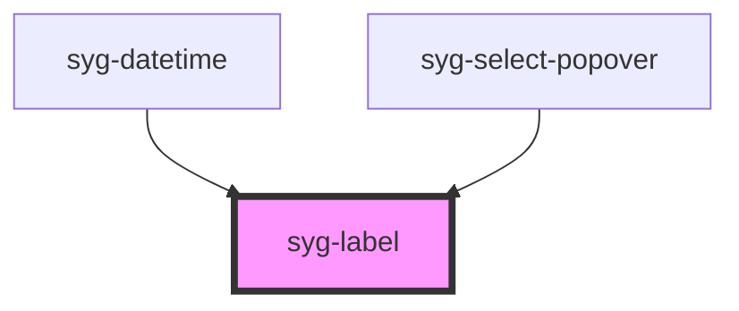

# syg-label

Label is a wrapper element that can be used in combination with `syg-item`, `syg-input`, `syg-toggle`, and more. The position of the label inside of an item can be inline, fixed, stacked, or floating.


<!-- Auto Generated Below -->


## Usage

### Angular / javascript

```html
<!-- Default Label -->
<syg-label>Label</syg-label>

<!-- Label Colors -->
<syg-label color="primary">Primary Label</syg-label>
<syg-label color="secondary">Secondary Label</syg-label>
<syg-label color="danger">Danger Label</syg-label>
<syg-label color="light">Light Label</syg-label>
<syg-label color="dark">Dark Label</syg-label>

<!-- Item Labels -->
<syg-item>
  <syg-label>Default Item</syg-label>
</syg-item>

<syg-item>
  <syg-label class="syg-text-wrap">
    Multi-line text that should wrap when it is too long
    to fit on one line in the item.
  </syg-label>
</syg-item>

<!-- Input Labels -->
<syg-item>
  <syg-label>Default Input</syg-label>
  <syg-input></syg-input>
</syg-item>

<syg-item>
  <syg-label position="fixed">Fixed</syg-label>
  <syg-input></syg-input>
</syg-item>

<syg-item>
  <syg-label position="floating">Floating</syg-label>
  <syg-input></syg-input>
</syg-item>

<syg-item>
  <syg-label position="stacked">Stacked</syg-label>
  <syg-input></syg-input>
</syg-item>

<syg-item>
  <syg-label>Toggle</syg-label>
  <syg-toggle slot="end" checked></syg-toggle>
</syg-item>

<syg-item>
  <syg-checkbox slot="start" checked></syg-checkbox>
  <syg-label>Checkbox</syg-label>
</syg-item>
```


### React

```tsx
import React from 'react';
import { IonLabel, IonItem, IonInput, IonToggle, IonCheckbox, IonContent } from '@ionic/react';

export const LabelExample: React.FC = () => (
  <IonContent>
    {/*-- Default Label --*/}
    <IonLabel>Label</IonLabel><br />

    {/*-- Label Colors --*/}
    <IonLabel color="primary">Primary Label</IonLabel><br />
    <IonLabel color="secondary">Secondary Label</IonLabel><br />
    <IonLabel color="danger">Danger Label</IonLabel><br />
    <IonLabel color="light">Light Label</IonLabel><br />
    <IonLabel color="dark">Dark Label</IonLabel><br />

    {/*-- Item Labels --*/}
    <IonItem>
      <IonLabel>Default Item</IonLabel>
    </IonItem>

    <IonItem>
      <IonLabel className="syg-text-wrap">
        Multi-line text that should wrap when it is too long
        to fit on one line in the item.
      </IonLabel>
    </IonItem>

    {/*-- Input Labels --*/}
    <IonItem>
      <IonLabel>Default Input</IonLabel>
      <IonInput></IonInput>
    </IonItem>

    <IonItem>
      <IonLabel position="fixed">Fixed</IonLabel>
      <IonInput></IonInput>
    </IonItem>

    <IonItem>
      <IonLabel position="floating">Floating</IonLabel>
      <IonInput></IonInput>
    </IonItem>

    <IonItem>
      <IonLabel position="stacked">Stacked</IonLabel>
      <IonInput></IonInput>
    </IonItem>

    <IonItem>
      <IonLabel>Toggle</IonLabel>
      <IonToggle slot="end" checked></IonToggle>
    </IonItem>

    <IonItem>
      <IonCheckbox slot="start" checked />
      <IonLabel>Checkbox</IonLabel>
    </IonItem>
  </IonContent>
);
```


### Stencil

```tsx
import { Component, h } from '@stencil/core';

@Component({
  tag: 'label-example',
  styleUrl: 'label-example.css'
})
export class LabelExample {
  render() {
    return [
      // Default Label
      <syg-label>Label</syg-label>,

      // Label Colors
      <syg-label color="primary">Primary Label</syg-label>,
      <syg-label color="secondary">Secondary Label</syg-label>,
      <syg-label color="danger">Danger Label</syg-label>,
      <syg-label color="light">Light Label</syg-label>,
      <syg-label color="dark">Dark Label</syg-label>,

      // Item Labels
      <syg-item>
        <syg-label>Default Item</syg-label>
      </syg-item>,

      <syg-item>
        <syg-label class="syg-text-wrap">
          Multi-line text that should wrap when it is too long
          to fit on one line in the item.
        </syg-label>
      </syg-item>,

      // Input Labels
      <syg-item>
        <syg-label>Default Input</syg-label>
        <syg-input></syg-input>
      </syg-item>,

      <syg-item>
        <syg-label position="fixed">Fixed</syg-label>
        <syg-input></syg-input>
      </syg-item>,

      <syg-item>
        <syg-label position="floating">Floating</syg-label>
        <syg-input></syg-input>
      </syg-item>,

      <syg-item>
        <syg-label position="stacked">Stacked</syg-label>
        <syg-input></syg-input>
      </syg-item>,

      <syg-item>
        <syg-label>Toggle</syg-label>
        <syg-toggle slot="end" checked={true}></syg-toggle>
      </syg-item>,

      <syg-item>
        <syg-checkbox slot="start" checked={true}></syg-checkbox>
        <syg-label>Checkbox</syg-label>
      </syg-item>
    ];
  }
}
```


### Vue

```html
<template>
  <!-- Default Label -->
  <syg-label>Label</syg-label>

  <!-- Label Colors -->
  <syg-label color="primary">Primary Label</syg-label>
  <syg-label color="secondary">Secondary Label</syg-label>
  <syg-label color="danger">Danger Label</syg-label>
  <syg-label color="light">Light Label</syg-label>
  <syg-label color="dark">Dark Label</syg-label>

  <!-- Item Labels -->
  <syg-item>
    <syg-label>Default Item</syg-label>
  </syg-item>

  <syg-item>
    <syg-label class="syg-text-wrap">
      Multi-line text that should wrap when it is too long
      to fit on one line in the item.
    </syg-label>
  </syg-item>

  <!-- Input Labels -->
  <syg-item>
    <syg-label>Default Input</syg-label>
    <syg-input></syg-input>
  </syg-item>

  <syg-item>
    <syg-label position="fixed">Fixed</syg-label>
    <syg-input></syg-input>
  </syg-item>

  <syg-item>
    <syg-label position="floating">Floating</syg-label>
    <syg-input></syg-input>
  </syg-item>

  <syg-item>
    <syg-label position="stacked">Stacked</syg-label>
    <syg-input></syg-input>
  </syg-item>

  <syg-item>
    <syg-label>Toggle</syg-label>
    <syg-toggle slot="end" checked></syg-toggle>
  </syg-item>

  <syg-item>
    <syg-checkbox slot="start" checked></syg-checkbox>
    <syg-label>Checkbox</syg-label>
  </syg-item>
</template>

<script>
import { 
  IonCheckbox, 
  IonInput, 
  IonItem, 
  IonLabel,
  IonToggle
} from '@ionic/vue';
import { defineComponent } from 'vue';

export default defineComponent({
  components: { 
    IonCheckbox, 
    IonInput, 
    IonItem, 
    IonLabel,
    IonToggle
  }
});
</script>
```


## Properties

| Property   | Attribute  | Description                                                                                                                                                                                                                                                            | Type                                              | Default     |
| ---------- | ---------- | ---------------------------------------------------------------------------------------------------------------------------------------------------------------------------------------------------------------------------------------------------------------------- | ------------------------------------------------- | ----------- |
| `color`    | `color`    | The color to use from your application's color palette. Default options are: `"primary"`, `"secondary"`, `"tertiary"`, `"success"`, `"warning"`, `"danger"`, `"light"`, `"medium"`, and `"dark"`. For more information on colors, see [theming](/docs/theming/basics). | `string \| undefined`                             | `undefined` |
| `mode`     | `mode`     | The mode determines which platform styles to use.                                                                                                                                                                                                                      | `"ios" \| "md"`                                   | `undefined` |
| `position` | `position` | The position determines where and how the label behaves inside an item.                                                                                                                                                                                                | `"fixed" \| "floating" \| "stacked" \| undefined` | `undefined` |


## CSS Custom Properties

| Name      | Description        |
| --------- | ------------------ |
| `--color` | Color of the label |


## Dependencies

### Used by

 - [syg-datetime](../datetime)
 - syg-select-popover

### Graph


----------------------------------------------

*Built with [StencilJS](https://stenciljs.com/)*
