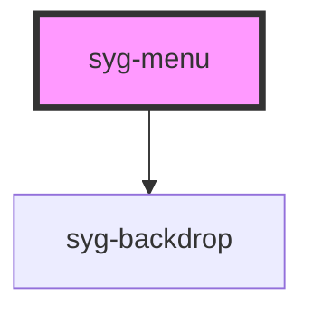

# syg-menu

The Menu component is a navigation drawer that slides in from the side of the current view.
By default, it slides in from the left, but the side can be overridden.
The menu will be displayed differently based on the mode, however the display type can be changed to any of the available menu types.
The menu element should be a sibling to the root content element.
There can be any number of menus attached to the content.
These can be controlled from the templates, or programmatically using the MenuController.

## Interfaces

### MenuCustomEvent

While not required, this interface can be used in place of the `CustomEvent` interface for stronger typing with Ionic events emitted from this component.

```typescript
interface MenuCustomEvent<T = any> extends CustomEvent {
  detail: T;
  target: HTMLIonMenuElement;
}
```

<!-- Auto Generated Below -->


## Usage

### Angular

```html
<syg-menu side="start" menuId="first" contentId="main">
  <syg-header>
    <syg-toolbar color="primary">
      <syg-title>Start Menu</syg-title>
    </syg-toolbar>
  </syg-header>
  <syg-content>
    <syg-list>
      <syg-item>Menu Item</syg-item>
      <syg-item>Menu Item</syg-item>
      <syg-item>Menu Item</syg-item>
      <syg-item>Menu Item</syg-item>
      <syg-item>Menu Item</syg-item>
    </syg-list>
  </syg-content>
</syg-menu>

<syg-menu side="start" menuId="custom" contentId="main" class="my-custom-menu">
  <syg-header>
    <syg-toolbar color="tertiary">
      <syg-title>Custom Menu</syg-title>
    </syg-toolbar>
  </syg-header>
  <syg-content>
    <syg-list>
      <syg-item>Menu Item</syg-item>
      <syg-item>Menu Item</syg-item>
      <syg-item>Menu Item</syg-item>
      <syg-item>Menu Item</syg-item>
      <syg-item>Menu Item</syg-item>
    </syg-list>
  </syg-content>
</syg-menu>

<syg-menu side="end" type="push" contentId="main">
  <syg-header>
    <syg-toolbar color="danger">
      <syg-title>End Menu</syg-title>
    </syg-toolbar>
  </syg-header>
  <syg-content>
    <syg-list>
      <syg-item>Menu Item</syg-item>
      <syg-item>Menu Item</syg-item>
      <syg-item>Menu Item</syg-item>
      <syg-item>Menu Item</syg-item>
      <syg-item>Menu Item</syg-item>
    </syg-list>
  </syg-content>
</syg-menu>

<syg-router-outlet id="main"></syg-router-outlet>
```

```typescript
import { Component } from '@angular/core';
import { MenuController } from '@ionic/angular';

@Component({
  selector: 'menu-example',
  templateUrl: 'menu-example.html',
  styleUrls: ['./menu-example.css'],
})
export class MenuExample {

constructor(private menu: MenuController) { }

  openFirst() {
    this.menu.enable(true, 'first');
    this.menu.open('first');
  }

  openEnd() {
    this.menu.open('end');
  }

  openCustom() {
    this.menu.enable(true, 'custom');
    this.menu.open('custom');
  }
}
```

```css
.my-custom-menu {
  --width: 500px;
}
```


### Javascript

```html
<syg-app>
  <syg-menu side="start" menu-id="first" content-id="main">
    <syg-header>
      <syg-toolbar color="primary">
        <syg-title>Start Menu</syg-title>
      </syg-toolbar>
    </syg-header>
    <syg-content>
      <syg-list>
        <syg-item>Menu Item</syg-item>
        <syg-item>Menu Item</syg-item>
        <syg-item>Menu Item</syg-item>
        <syg-item>Menu Item</syg-item>
        <syg-item>Menu Item</syg-item>
      </syg-list>
    </syg-content>
  </syg-menu>

  <syg-menu side="start" menu-id="custom" class="my-custom-menu" content-id="main">
    <syg-header>
      <syg-toolbar color="tertiary">
        <syg-title>Custom Menu</syg-title>
      </syg-toolbar>
    </syg-header>
    <syg-content>
      <syg-list>
        <syg-item>Menu Item</syg-item>
        <syg-item>Menu Item</syg-item>
        <syg-item>Menu Item</syg-item>
        <syg-item>Menu Item</syg-item>
        <syg-item>Menu Item</syg-item>
      </syg-list>
    </syg-content>
  </syg-menu>

  <syg-menu side="end" type="push" content-id="main">
    <syg-header>
      <syg-toolbar color="danger">
        <syg-title>End Menu</syg-title>
      </syg-toolbar>
    </syg-header>
    <syg-content>
      <syg-list>
        <syg-item>Menu Item</syg-item>
        <syg-item>Menu Item</syg-item>
        <syg-item>Menu Item</syg-item>
        <syg-item>Menu Item</syg-item>
        <syg-item>Menu Item</syg-item>
      </syg-list>
    </syg-content>
  </syg-menu>

  <div class="syg-page" id="main">
    <syg-header>
      <syg-toolbar>
        <syg-title>Menu - Basic</syg-title>
      </syg-toolbar>
    </syg-header>
    <syg-content class="syg-padding">
      <syg-button expand="block" onclick="openFirst()">Open Start Menu</syg-button>
      <syg-button expand="block" onclick="openEnd()">Open End Menu</syg-button>
      <syg-button expand="block" onclick="openCustom()">Open Custom Menu</syg-button>
    </syg-content>
  </div>

</syg-app>
```

```javascript
<script type="module">
    import { menuController } from '@ionic/core';
    window.menuController = menuController;
</script>
  
<script>
  function openFirst() {
    menuController.enable(true, 'first');
    menuController.open('first');
  }
  
  function openEnd() {
    menuController.open('end');
  }
  
  function openCustom() {
    menuController.enable(true, 'custom');
    menuController.open('custom');
  }
</script>
```

```css
.my-custom-menu {
  --width: 500px;
}
```


### React

```tsx
import React from 'react';
import { IonMenu, IonHeader, IonToolbar, IonTitle, IonContent, IonList, IonItem, IonRouterOutlet } from '@ionic/react';

export const MenuExample: React.FC = () => (
  <>
    <IonMenu side="start" menuId="first">
      <IonHeader>
        <IonToolbar color="primary">
          <IonTitle>Start Menu</IonTitle>
        </IonToolbar>
      </IonHeader>
      <IonContent>
        <IonList>
          <IonItem>Menu Item</IonItem>
          <IonItem>Menu Item</IonItem>
          <IonItem>Menu Item</IonItem>
          <IonItem>Menu Item</IonItem>
          <IonItem>Menu Item</IonItem>
        </IonList>
      </IonContent>
    </IonMenu>

    <IonMenu side="start" menuId="custom" className="my-custom-menu">
      <IonHeader>
        <IonToolbar color="tertiary">
          <IonTitle>Custom Menu</IonTitle>
        </IonToolbar>
      </IonHeader>
      <IonContent>
        <IonList>
          <IonItem>Menu Item</IonItem>
          <IonItem>Menu Item</IonItem>
          <IonItem>Menu Item</IonItem>
          <IonItem>Menu Item</IonItem>
          <IonItem>Menu Item</IonItem>
        </IonList>
      </IonContent>
    </IonMenu>

    <IonMenu side="end" type="push">
      <IonHeader>
        <IonToolbar color="danger">
          <IonTitle>End Menu</IonTitle>
        </IonToolbar>
      </IonHeader>
      <IonContent>
        <IonList>
          <IonItem>Menu Item</IonItem>
          <IonItem>Menu Item</IonItem>
          <IonItem>Menu Item</IonItem>
          <IonItem>Menu Item</IonItem>
          <IonItem>Menu Item</IonItem>
        </IonList>
      </IonContent>
    </IonMenu>
    <IonRouterOutlet></IonRouterOutlet>
  </>
);
```


### Stencil

```tsx
import { Component, h } from '@stencil/core';

import { menuController } from '@ionic/core';

@Component({
  tag: 'menu-example',
  styleUrl: 'menu-example.css'
})
export class MenuExample {
  openFirst() {
    menuController.enable(true, 'first');
    menuController.open('first');
  }

  openEnd() {
    menuController.open('end');
  }

  openCustom() {
    menuController.enable(true, 'custom');
    menuController.open('custom');
  }

  render() {
    return [
      <syg-menu side="start" menuId="first" contentId="main">
        <syg-header>
          <syg-toolbar color="primary">
            <syg-title>Start Menu</syg-title>
          </syg-toolbar>
        </syg-header>
        <syg-content>
          <syg-list>
            <syg-item>Menu Item</syg-item>
            <syg-item>Menu Item</syg-item>
            <syg-item>Menu Item</syg-item>
            <syg-item>Menu Item</syg-item>
            <syg-item>Menu Item</syg-item>
          </syg-list>
        </syg-content>
      </syg-menu>,

      <syg-menu side="start" menuId="custom" contentId="main" class="my-custom-menu">
        <syg-header>
          <syg-toolbar color="tertiary">
            <syg-title>Custom Menu</syg-title>
          </syg-toolbar>
        </syg-header>
        <syg-content>
          <syg-list>
            <syg-item>Menu Item</syg-item>
            <syg-item>Menu Item</syg-item>
            <syg-item>Menu Item</syg-item>
            <syg-item>Menu Item</syg-item>
            <syg-item>Menu Item</syg-item>
          </syg-list>
        </syg-content>
      </syg-menu>,

      <syg-menu side="end" type="push" contentId="main">
        <syg-header>
          <syg-toolbar color="danger">
            <syg-title>End Menu</syg-title>
          </syg-toolbar>
        </syg-header>
        <syg-content>
          <syg-list>
            <syg-item>Menu Item</syg-item>
            <syg-item>Menu Item</syg-item>
            <syg-item>Menu Item</syg-item>
            <syg-item>Menu Item</syg-item>
            <syg-item>Menu Item</syg-item>
          </syg-list>
        </syg-content>
      </syg-menu>,

      // A router outlet can be placed here instead
      <syg-content id="main">
        <syg-button expand="block" onClick={() => this.openFirst()}>Open Start Menu</syg-button>
        <syg-button expand="block" onClick={() => this.openEnd()}>Open End Menu</syg-button>
        <syg-button expand="block" onClick={() => this.openCustom()}>Open Custom Menu</syg-button>
      </syg-content>
    ];
  }
}
```

```css
.my-custom-menu {
  --width: 500px;
}
```


### Vue

```html
<template>
  <syg-menu side="start" menu-id="first" content-id="main">
    <syg-header>
      <syg-toolbar color="primary">
        <syg-title>Start Menu</syg-title>
      </syg-toolbar>
    </syg-header>
    <syg-content>
      <syg-list>
        <syg-item>Menu Item</syg-item>
        <syg-item>Menu Item</syg-item>
        <syg-item>Menu Item</syg-item>
        <syg-item>Menu Item</syg-item>
        <syg-item>Menu Item</syg-item>
      </syg-list>
    </syg-content>
  </syg-menu>

  <syg-menu side="start" menu-id="custom" class="my-custom-menu" content-id="main">
    <syg-header>
      <syg-toolbar color="tertiary">
        <syg-title>Custom Menu</syg-title>
      </syg-toolbar>
    </syg-header>
    <syg-content>
      <syg-list>
        <syg-item>Menu Item</syg-item>
        <syg-item>Menu Item</syg-item>
        <syg-item>Menu Item</syg-item>
        <syg-item>Menu Item</syg-item>
        <syg-item>Menu Item</syg-item>
      </syg-list>
    </syg-content>
  </syg-menu>

  <syg-menu side="end" type="push" content-id="main">
    <syg-header>
      <syg-toolbar color="danger">
        <syg-title>End Menu</syg-title>
      </syg-toolbar>
    </syg-header>
    <syg-content>
      <syg-list>
        <syg-item>Menu Item</syg-item>
        <syg-item>Menu Item</syg-item>
        <syg-item>Menu Item</syg-item>
        <syg-item>Menu Item</syg-item>
        <syg-item>Menu Item</syg-item>
      </syg-list>
    </syg-content>
  </syg-menu>

  <syg-router-outlet id="main"></syg-router-outlet>
</template>
<style>
.my-custom-menu {
  --width: 500px;
}
</style>

<script>
import { 
  IonContent, 
  IonHeader, 
  IonItem, 
  IonList, 
  IonMenu, 
  IonRouterOutlet,
  IonTitle, 
  IonToolbar,
  menuController
} from '@ionic/vue';
import { defineComponent } from 'vue';

export default defineComponent({
  components: {
    IonContent, 
    IonHeader, 
    IonItem, 
    IonList, 
    IonMenu, 
    IonRouterOutlet,
    IonTitle, 
    IonToolbar
  },
  methods: {
    openFirst() {
      menuController.enable(true, 'first');
      menuController.open('first');
    },
    openEnd() {
      menuController.open('end');
    },
    openCustom() {
      menuController.enable(true, 'custom');
      menuController.open('custom');
    }
  }
});
</script>
```


## Properties

| Property       | Attribute        | Description                                                                                                                                                                                                                            | Type                  | Default     |
| -------------- | ---------------- | -------------------------------------------------------------------------------------------------------------------------------------------------------------------------------------------------------------------------------------- | --------------------- | ----------- |
| `contentId`    | `content-id`     | The `id` of the main content. When using a router this is typically `syg-router-outlet`. When not using a router, this is typically your main view's `syg-content`. This is not the id of the `syg-content` inside of your `syg-menu`. | `string \| undefined` | `undefined` |
| `disabled`     | `disabled`       | If `true`, the menu is disabled.                                                                                                                                                                                                       | `boolean`             | `false`     |
| `maxEdgeStart` | `max-edge-start` | The edge threshold for dragging the menu open. If a drag/swipe happens over this value, the menu is not triggered.                                                                                                                     | `number`              | `50`        |
| `menuId`       | `menu-id`        | An id for the menu.                                                                                                                                                                                                                    | `string \| undefined` | `undefined` |
| `side`         | `side`           | Which side of the view the menu should be placed.                                                                                                                                                                                      | `"end" \| "start"`    | `'start'`   |
| `swipeGesture` | `swipe-gesture`  | If `true`, swiping the menu is enabled.                                                                                                                                                                                                | `boolean`             | `true`      |
| `type`         | `type`           | The display type of the menu. Available options: `"overlay"`, `"reveal"`, `"push"`.                                                                                                                                                    | `string \| undefined` | `undefined` |


## Events

| Event          | Description                                  | Type                |
| -------------- | -------------------------------------------- | ------------------- |
| `ionDidClose`  | Emitted when the menu is closed.             | `CustomEvent<void>` |
| `ionDidOpen`   | Emitted when the menu is open.               | `CustomEvent<void>` |
| `ionWillClose` | Emitted when the menu is about to be closed. | `CustomEvent<void>` |
| `ionWillOpen`  | Emitted when the menu is about to be opened. | `CustomEvent<void>` |


## Methods

### `close(animated?: boolean) => Promise<boolean>`

Closes the menu. If the menu is already closed or it can't be closed,
it returns `false`.

#### Returns

Type: `Promise<boolean>`


### `isActive() => Promise<boolean>`

Returns `true` is the menu is active.

A menu is active when it can be opened or closed, meaning it's enabled
and it's not part of a `syg-split-pane`.

#### Returns

Type: `Promise<boolean>`


### `isOpen() => Promise<boolean>`

Returns `true` is the menu is open.

#### Returns

Type: `Promise<boolean>`


### `open(animated?: boolean) => Promise<boolean>`

Opens the menu. If the menu is already open or it can't be opened,
it returns `false`.

#### Returns

Type: `Promise<boolean>`


### `setOpen(shouldOpen: boolean, animated?: boolean) => Promise<boolean>`

Opens or closes the button.
If the operation can't be completed successfully, it returns `false`.

#### Returns

Type: `Promise<boolean>`


### `toggle(animated?: boolean) => Promise<boolean>`

Toggles the menu. If the menu is already open, it will try to close, otherwise it will try to open it.
If the operation can't be completed successfully, it returns `false`.

#### Returns

Type: `Promise<boolean>`


## Shadow Parts

| Part          | Description                                                            |
| ------------- | ---------------------------------------------------------------------- |
| `"backdrop"`  | The backdrop that appears over the main content when the menu is open. |
| `"container"` | The container for the menu content.                                    |


## CSS Custom Properties

| Name           | Description                |
| -------------- | -------------------------- |
| `--background` | Background of the menu     |
| `--height`     | Height of the menu         |
| `--max-height` | Maximum height of the menu |
| `--max-width`  | Maximum width of the menu  |
| `--min-height` | Minimum height of the menu |
| `--min-width`  | Minimum width of the menu  |
| `--width`      | Width of the menu          |


## Dependencies

### Depends on

- [syg-backdrop](../backdrop)

### Graph


----------------------------------------------

*Built with [StencilJS](https://stenciljs.com/)*
