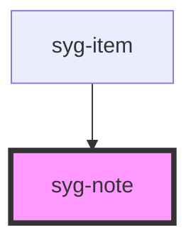

# syg-note

Notes are text elements generally used as subtitles that provide more information. Notes are styled to appear grey by default. Notes can be used in an item as metadata text.


<!-- Auto Generated Below -->


## Usage

### Angular / javascript

```html
<!-- Default Note -->
<syg-note>Default Note</syg-note>

<!-- Note Colors -->
<syg-note color="primary">Primary Note</syg-note>
<syg-note color="secondary">Secondary Note</syg-note>
<syg-note color="danger">Danger Note</syg-note>
<syg-note color="light">Light Note</syg-note>
<syg-note color="dark">Dark Note</syg-note>

<!-- Notes in a List -->
<syg-list>
  <syg-item>
    <syg-label>Note (End)</syg-label>
    <syg-note slot="end">On</syg-note>
  </syg-item>

  <syg-item>
    <syg-note slot="start">Off</syg-note>
    <syg-label>Note (Start)</syg-label>
  </syg-item>
</syg-list>
```


### React

```tsx
import React from 'react';
import { IonNote, IonList, IonItem, IonLabel, IonContent } from '@ionic/react';

export const NoteExample: React.FC = () => (
  <IonContent>
    {/*-- Default Note --*/}
    <IonNote>Default Note</IonNote><br />

    {/*-- Note Colors --*/}
    <IonNote color="primary">Primary Note</IonNote><br />
    <IonNote color="secondary">Secondary Note</IonNote><br />
    <IonNote color="danger">Danger Note</IonNote><br />
    <IonNote color="light">Light Note</IonNote><br />
    <IonNote color="dark">Dark Note</IonNote><br />

    {/*-- Notes in a List --*/}
    <IonList>
      <IonItem>
        <IonLabel>Note (End)</IonLabel>
        <IonNote slot="end">On</IonNote>
      </IonItem>

      <IonItem>
        <IonNote slot="start">Off</IonNote>
        <IonLabel>Note (Start)</IonLabel>
      </IonItem>
    </IonList>
  </IonContent>
);
```


### Stencil

```tsx
import { Component, h } from '@stencil/core';

@Component({
  tag: 'note-example',
  styleUrl: 'note-example.css'
})
export class NoteExample {
  render() {
    return [
      // Default Note
      <syg-note>Default Note</syg-note>,

      // Note Colors
      <syg-note color="primary">Primary Note</syg-note>,
      <syg-note color="secondary">Secondary Note</syg-note>,
      <syg-note color="danger">Danger Note</syg-note>,
      <syg-note color="light">Light Note</syg-note>,
      <syg-note color="dark">Dark Note</syg-note>,

      // Notes in a List
      <syg-list>
        <syg-item>
          <syg-label>Note (End)</syg-label>
          <syg-note slot="end">On</syg-note>
        </syg-item>

        <syg-item>
          <syg-note slot="start">Off</syg-note>
          <syg-label>Note (Start)</syg-label>
        </syg-item>
      </syg-list>
    ];
  }
}
```


### Vue

```html
<template>
  <!-- Default Note -->
  <syg-note>Default Note</syg-note>

  <!-- Note Colors -->
  <syg-note color="primary">Primary Note</syg-note>
  <syg-note color="secondary">Secondary Note</syg-note>
  <syg-note color="danger">Danger Note</syg-note>
  <syg-note color="light">Light Note</syg-note>
  <syg-note color="dark">Dark Note</syg-note>

  <!-- Notes in a List -->
  <syg-list>
    <syg-item>
      <syg-label>Note (End)</syg-label>
      <syg-note slot="end">On</syg-note>
    </syg-item>

    <syg-item>
      <syg-note slot="start">Off</syg-note>
      <syg-label>Note (Start)</syg-label>
    </syg-item>
  </syg-list>
</template>

<script>
import { IonItem, IonLabel, IonList, IonNote } from '@ionic/vue';
import { defineComponent } from 'vue';

export default defineComponent({
  components: { IonItem, IonLabel, IonList, IonNote }
});
</script>
```


## Properties

| Property | Attribute | Description                                                                                                                                                                                                                                                            | Type                  | Default     |
| -------- | --------- | ---------------------------------------------------------------------------------------------------------------------------------------------------------------------------------------------------------------------------------------------------------------------- | --------------------- | ----------- |
| `color`  | `color`   | The color to use from your application's color palette. Default options are: `"primary"`, `"secondary"`, `"tertiary"`, `"success"`, `"warning"`, `"danger"`, `"light"`, `"medium"`, and `"dark"`. For more information on colors, see [theming](/docs/theming/basics). | `string \| undefined` | `undefined` |
| `mode`   | `mode`    | The mode determines which platform styles to use.                                                                                                                                                                                                                      | `"ios" \| "md"`       | `undefined` |


## CSS Custom Properties

| Name      | Description       |
| --------- | ----------------- |
| `--color` | Color of the note |


## Dependencies

### Used by

 - [syg-item](../item)

### Graph


----------------------------------------------

*Built with [StencilJS](https://stenciljs.com/)*
