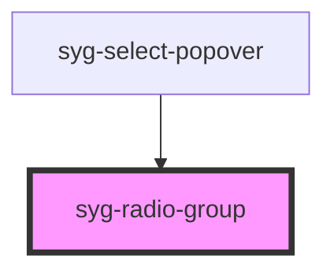

# syg-radio-group

A radio group is a group of [radio buttons](../radio). It allows
a user to select at most one radio button from a set. Checking one radio
button that belongs to a radio group unchecks any previous checked
radio button within the same group.

## Interfaces

### RadioGroupChangeEventDetail

```typescript
interface RadioGroupChangeEventDetail<T = any> {
  value: T;
}
```

### RadioGroupCustomEvent

While not required, this interface can be used in place of the `CustomEvent` interface for stronger typing with Ionic events emitted from this component.

```typescript
interface RadioGroupCustomEvent<T = any> extends CustomEvent {
  detail: RadioGroupChangeEventDetail<T>;
  target: HTMLIonRadioGroupElement;
}
```

<!-- Auto Generated Below -->


## Usage

### Angular / javascript

```html
<syg-list>
  <syg-radio-group>
    <syg-list-header>
      <syg-label>
        Auto Manufacturers
      </syg-label>
    </syg-list-header>

    <syg-item>
      <syg-label>Cord</syg-label>
      <syg-radio value="cord"></syg-radio>
    </syg-item>

    <syg-item>
      <syg-label>Duesenberg</syg-label>
      <syg-radio value="duesenberg"></syg-radio>
    </syg-item>

    <syg-item>
      <syg-label>Hudson</syg-label>
      <syg-radio value="hudson"></syg-radio>
    </syg-item>

    <syg-item>
      <syg-label>Packard</syg-label>
      <syg-radio value="packard"></syg-radio>
    </syg-item>

    <syg-item>
      <syg-label>Studebaker</syg-label>
      <syg-radio value="studebaker"></syg-radio>
    </syg-item>
  </syg-radio-group>
</syg-list>
```


### React

```tsx
import React from 'react';
import { IonList, IonRadioGroup, IonListHeader, IonLabel, IonRadio, IonItem, IonContent } from '@ionic/react';

export const RadioGroupExample: React.FC = () => (
  <IonContent>
    <IonList>
      <IonRadioGroup>
        <IonListHeader>
          <IonLabel>
            Auto Manufacturers
          </IonLabel>
        </IonListHeader>

        <IonItem>
          <IonLabel>Cord</IonLabel>
          <IonRadio value="cord" />
        </IonItem>

        <IonItem>
          <IonLabel>Duesenberg</IonLabel>
          <IonRadio value="duesenberg" />
        </IonItem>

        <IonItem>
          <IonLabel>Hudson</IonLabel>
          <IonRadio value="hudson" />
        </IonItem>

        <IonItem>
          <IonLabel>Packard</IonLabel>
          <IonRadio value="packard" />
        </IonItem>

        <IonItem>
          <IonLabel>Studebaker</IonLabel>
          <IonRadio value="studebaker" />
        </IonItem>
      </IonRadioGroup>
    </IonList>
  </IonContent>
);
```


### Stencil

```tsx
import { Component, h } from '@stencil/core';

@Component({
  tag: 'radio-group-example',
  styleUrl: 'radio-group-example.css'
})
export class RadioGroupExample {
  render() {
    return [
      <syg-list>
        <syg-radio-group>
          <syg-list-header>
            <syg-label>
              Auto Manufacturers
            </syg-label>
          </syg-list-header>

          <syg-item>
            <syg-label>Cord</syg-label>
            <syg-radio value="cord"></syg-radio>
          </syg-item>

          <syg-item>
            <syg-label>Duesenberg</syg-label>
            <syg-radio value="duesenberg"></syg-radio>
          </syg-item>

          <syg-item>
            <syg-label>Hudson</syg-label>
            <syg-radio value="hudson"></syg-radio>
          </syg-item>

          <syg-item>
            <syg-label>Packard</syg-label>
            <syg-radio value="packard"></syg-radio>
          </syg-item>

          <syg-item>
            <syg-label>Studebaker</syg-label>
            <syg-radio value="studebaker"></syg-radio>
          </syg-item>
        </syg-radio-group>
      </syg-list>
    ];
  }
}
```


### Vue

```html
<template>
  <syg-list>
    <syg-radio-group>
      <syg-list-header>
        <syg-label>
          Auto Manufacturers
        </syg-label>
      </syg-list-header>

      <syg-item>
        <syg-label>Cord</syg-label>
        <syg-radio value="cord"></syg-radio>
      </syg-item>

      <syg-item>
        <syg-label>Duesenberg</syg-label>
        <syg-radio value="duesenberg"></syg-radio>
      </syg-item>

      <syg-item>
        <syg-label>Hudson</syg-label>
        <syg-radio value="hudson"></syg-radio>
      </syg-item>

      <syg-item>
        <syg-label>Packard</syg-label>
        <syg-radio value="packard"></syg-radio>
      </syg-item>

      <syg-item>
        <syg-label>Studebaker</syg-label>
        <syg-radio value="studebaker"></syg-radio>
      </syg-item>
    </syg-radio-group>
  </syg-list>
</template>

<script>
import { 
  IonItem, 
  IonLabel, 
  IonList, 
  IonListHeader, 
  IonRadio, 
  IonRadioGroup
} from '@ionic/vue';
import { defineComponent } from 'vue';

export default defineComponent({
  components: {
    IonItem, 
    IonLabel, 
    IonList, 
    IonListHeader, 
    IonRadio, 
    IonRadioGroup
  }
});
</script>
```


## Properties

| Property              | Attribute               | Description                                                     | Type      | Default        |
| --------------------- | ----------------------- | --------------------------------------------------------------- | --------- | -------------- |
| `allowEmptySelection` | `allow-empty-selection` | If `true`, the radios can be deselected.                        | `boolean` | `false`        |
| `name`                | `name`                  | The name of the control, which is submitted with the form data. | `string`  | `this.inputId` |
| `value`               | `value`                 | the value of the radio group.                                   | `any`     | `undefined`    |


## Events

| Event       | Description                         | Type                                            |
| ----------- | ----------------------------------- | ----------------------------------------------- |
| `ionChange` | Emitted when the value has changed. | `CustomEvent<RadioGroupChangeEventDetail<any>>` |


## Dependencies

### Used by

 - syg-select-popover

### Graph


----------------------------------------------

*Built with [StencilJS](https://stenciljs.com/)*
