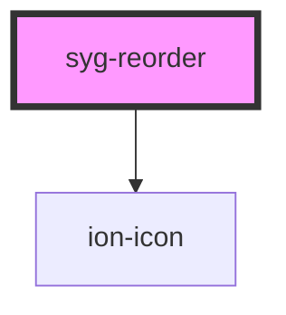

# syg-reorder

Reorder is a component that allows an item in a group of items to be dragged to change its order within that group. It must be used within an `syg-reorder-group` to provide a visual drag and drop interface.

`syg-reorder` is the anchor used to drag and drop the items inside of the `syg-reorder-group`. See the [Reorder Group](../reorder-group) for more information on how to complete the reorder operation.


<!-- Auto Generated Below -->


## Usage

### Angular / javascript

```html
<!-- The reorder gesture is disabled by default, enable it to drag and drop items -->
<syg-reorder-group disabled="false">
  <!-- Default reorder icon, end aligned items -->
  <syg-item>
    <syg-label>
      Item 1
    </syg-label>
    <syg-reorder slot="end"></syg-reorder>
  </syg-item>

  <syg-item>
    <syg-label>
      Item 2
    </syg-label>
    <syg-reorder slot="end"></syg-reorder>
  </syg-item>

  <!-- Default reorder icon, start aligned items -->
  <syg-item>
    <syg-reorder slot="start"></syg-reorder>
    <syg-label>
      Item 3
    </syg-label>
  </syg-item>

  <syg-item>
    <syg-reorder slot="start"></syg-reorder>
    <syg-label>
      Item 4
    </syg-label>
  </syg-item>

  <!-- Custom reorder icon end items -->
  <syg-item>
    <syg-label>
      Item 5
    </syg-label>
    <syg-reorder slot="end">
      <ion-icon name="pizza"></ion-icon>
    </syg-reorder>
  </syg-item>

  <syg-item>
    <syg-label>
      Item 6
    </syg-label>
    <syg-reorder slot="end">
      <ion-icon name="pizza"></ion-icon>
    </syg-reorder>
  </syg-item>

  <!-- Items wrapped in a reorder, entire item can be dragged -->
  <syg-reorder>
    <syg-item>
      <syg-label>
        Item 7
      </syg-label>
    </syg-item>
  </syg-reorder>

  <syg-reorder>
    <syg-item>
      <syg-label>
        Item 8
      </syg-label>
    </syg-item>
  </syg-reorder>
</syg-reorder-group>
```


### React

```tsx
import React from 'react';
import { IonIcon, IonItem, IonLabel, IonReorder, IonReorderGroup, IonContent } from '@ionic/react';
import { pizza } from 'ionicons/icons';

export const ReorderExample: React.FC = () => (
  <IonContent>
    {/*-- The reorder gesture is disabled by default, enable it to drag and drop items --*/}
    <IonReorderGroup disabled={false}>
      {/*-- Default reorder icon, end aligned items --*/}
      <IonItem>
        <IonLabel>Item 1</IonLabel>
        <IonReorder slot="end" />
      </IonItem>

      <IonItem>
        <IonLabel>Item 2</IonLabel>
        <IonReorder slot="end" />
      </IonItem>

      {/*-- Default reorder icon, start aligned items --*/}
      <IonItem>
        <IonReorder slot="start" />
        <IonLabel>Item 3</IonLabel>
      </IonItem>

      <IonItem>
        <IonReorder slot="start" />
        <IonLabel>Item 4</IonLabel>
      </IonItem>

      {/*-- Custom reorder icon end items --*/}
      <IonItem>
        <IonLabel>Item 5</IonLabel>
        <IonReorder slot="end">
          <IonIcon icon={pizza} />
        </IonReorder>
      </IonItem>

      <IonItem>
        <IonLabel>Item 6</IonLabel>
        <IonReorder slot="end">
          <IonIcon icon={pizza} />
        </IonReorder>
      </IonItem>

      {/*-- Items wrapped in a reorder, entire item can be dragged --*/}
      <IonReorder>
        <IonItem>
          <IonLabel>Item 7</IonLabel>
        </IonItem>
      </IonReorder>

      <IonReorder>
        <IonItem>
          <IonLabel>Item 8</IonLabel>
        </IonItem>
      </IonReorder>
    </IonReorderGroup>
  </IonContent>
);
```


### Stencil

```tsx
import { Component, h } from '@stencil/core';

@Component({
  tag: 'reorder-example',
  styleUrl: 'reorder-example.css'
})
export class ReorderExample {
  render() {
    return [
      // The reorder gesture is disabled by default, enable it to drag and drop items
      <syg-reorder-group disabled={false}>
        {/* Default reorder icon, end aligned items */}
        <syg-item>
          <syg-label>
            Item 1
          </syg-label>
          <syg-reorder slot="end"></syg-reorder>
        </syg-item>

        <syg-item>
          <syg-label>
            Item 2
          </syg-label>
          <syg-reorder slot="end"></syg-reorder>
        </syg-item>

        {/* Default reorder icon, start aligned items */}
        <syg-item>
          <syg-reorder slot="start"></syg-reorder>
          <syg-label>
            Item 3
          </syg-label>
        </syg-item>

        <syg-item>
          <syg-reorder slot="start"></syg-reorder>
          <syg-label>
            Item 4
          </syg-label>
        </syg-item>

        {/* Custom reorder icon end items */}
        <syg-item>
          <syg-label>
            Item 5
          </syg-label>
          <syg-reorder slot="end">
            <ion-icon name="pizza"></ion-icon>
          </syg-reorder>
        </syg-item>

        <syg-item>
          <syg-label>
            Item 6
          </syg-label>
          <syg-reorder slot="end">
            <ion-icon name="pizza"></ion-icon>
          </syg-reorder>
        </syg-item>

        {/* Items wrapped in a reorder, entire item can be dragged */}
        <syg-reorder>
          <syg-item>
            <syg-label>
              Item 7
            </syg-label>
          </syg-item>
        </syg-reorder>

        <syg-reorder>
          <syg-item>
            <syg-label>
              Item 8
            </syg-label>
          </syg-item>
        </syg-reorder>
      </syg-reorder-group>
    ];
  }
}
```


### Vue

```html
<template>
  <!-- The reorder gesture is disabled by default, enable it to drag and drop items -->
  <syg-reorder-group :disabled="false">
    <!-- Default reorder icon, end aligned items -->
    <syg-item>
      <syg-label>
        Item 1
      </syg-label>
      <syg-reorder slot="end"></syg-reorder>
    </syg-item>

    <syg-item>
      <syg-label>
        Item 2
      </syg-label>
      <syg-reorder slot="end"></syg-reorder>
    </syg-item>

    <!-- Default reorder icon, start aligned items -->
    <syg-item>
      <syg-reorder slot="start"></syg-reorder>
      <syg-label>
        Item 3
      </syg-label>
    </syg-item>

    <syg-item>
      <syg-reorder slot="start"></syg-reorder>
      <syg-label>
        Item 4
      </syg-label>
    </syg-item>

    <!-- Custom reorder icon end items -->
    <syg-item>
      <syg-label>
        Item 5
      </syg-label>
      <syg-reorder slot="end">
        <ion-icon name="pizza"></ion-icon>
      </syg-reorder>
    </syg-item>

    <syg-item>
      <syg-label>
        Item 6
      </syg-label>
      <syg-reorder slot="end">
        <ion-icon name="pizza"></ion-icon>
      </syg-reorder>
    </syg-item>

    <!-- Items wrapped in a reorder, entire item can be dragged -->
    <syg-reorder>
      <syg-item>
        <syg-label>
          Item 7
        </syg-label>
      </syg-item>
    </syg-reorder>

    <syg-reorder>
      <syg-item>
        <syg-label>
          Item 8
        </syg-label>
      </syg-item>
    </syg-reorder>
  </syg-reorder-group>
</template>

<script>
import {
  IonIcon,
  IonItem,
  IonLabel,
  IonReorder,
  IonReorderGroup
} from '@ionic/vue';
import { pizza } from 'ionicons/icons';
import { defineComponent } from 'vue';

export default defineComponent({
  components: {
    IonIcon,
    IonItem,
    IonLabel,
    IonReorder,
    IonReorderGroup
  },
  setup() {
    return { pizza }
  }
});
</script>
```


## Shadow Parts

| Part     | Description                                     |
| -------- | ----------------------------------------------- |
| `"icon"` | The icon of the reorder handle (uses ion-icon). |


## Dependencies

### Depends on

- ion-icon

### Graph


----------------------------------------------

*Built with [StencilJS](https://stenciljs.com/)*
