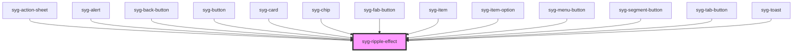

# syg-ripple-effect

The ripple effect component adds the [Material Design ink ripple interaction effect](https://material.io/develop/web/components/ripples/). This component can only be used inside of an `<syg-app>` and can be added to any component.

It's important to note that the parent should have [relative positioning](https://developer.mozilla.org/en-US/docs/Web/CSS/position) because the ripple effect is absolutely positioned and will cover the closest parent with relative positioning. The parent element should also be given the `syg-activatable` class, which tells the ripple effect that the element is clickable.

The default type, `"bounded"`, will expand the ripple effect from the click position outwards. To add a ripple effect that always starts in the center of the element and expands in a circle, add an `"unbounded"` type. It's recommended to add `overflow: hidden` to the parent element to avoid the ripple overflowing its container, especially with an unbounded ripple.

<!-- Auto Generated Below -->


## Usage

### Angular / javascript

```html
<syg-app>
  <syg-content>
    <div class="syg-activatable ripple-parent">
      A plain div with a bounded ripple effect
      <syg-ripple-effect></syg-ripple-effect>
    </div>

    <button class="syg-activatable ripple-parent">
      A button with a bounded ripple effect
      <syg-ripple-effect></syg-ripple-effect>
    </button>

    <div class="syg-activatable ripple-parent">
      A plain div with an unbounded ripple effect
      <syg-ripple-effect type="unbounded"></syg-ripple-effect>
    </div>

    <button class="syg-activatable ripple-parent">
      A button with an unbounded ripple effect
      <syg-ripple-effect type="unbounded"></syg-ripple-effect>
    </button>
  </syg-content>
</syg-app>
```

```css
.ripple-parent {
  position: relative;
  overflow: hidden;
}
```


### React

```tsx
import React from 'react';
import { IonApp, IonContent, IonRippleEffect } from '@ionic/react';
import './RippleEffectExample.css';

export const RippleExample: React.FC = () => (
  <IonApp>
   <IonContent>
      <div className="syg-activatable ripple-parent">
        A plain div with a bounded ripple effect
        <IonRippleEffect></IonRippleEffect>
      </div>

      <button className="syg-activatable ripple-parent">
        A button with a bounded ripple effect
        <IonRippleEffect></IonRippleEffect>
      </button>

      <div className="syg-activatable ripple-parent">
        A plain div with an unbounded ripple effect
        <IonRippleEffect type="unbounded"></IonRippleEffect>
      </div>

      <button className="syg-activatable ripple-parent">
        A button with an unbounded ripple effect
        <IonRippleEffect type="unbounded"></IonRippleEffect>
      </button>
    </IonContent>
  </IonApp>
);
```

```css
.ripple-parent {
  position: relative;
  overflow: hidden;
}
```


### Stencil

```tsx
import { Component, h } from '@stencil/core';

@Component({
  tag: 'ripple-effect-example',
  styleUrl: 'ripple-effect-example.css'
})
export class RippleEffectExample {
  render() {
    return [
      <syg-app>
        <syg-content>
          <div class="syg-activatable ripple-parent">
            A plain div with a bounded ripple effect
            <syg-ripple-effect></syg-ripple-effect>
          </div>

          <button class="syg-activatable ripple-parent">
            A button with a bounded ripple effect
            <syg-ripple-effect></syg-ripple-effect>
          </button>

          <div class="syg-activatable ripple-parent">
            A plain div with an unbounded ripple effect
            <syg-ripple-effect type="unbounded"></syg-ripple-effect>
          </div>

          <button class="syg-activatable ripple-parent">
            A button with an unbounded ripple effect
            <syg-ripple-effect type="unbounded"></syg-ripple-effect>
          </button>
        </syg-content>
      </syg-app>
    ];
  }
}
```

```css
.ripple-parent {
  position: relative;
  overflow: hidden;
}
```


### Vue

```html
<template>
  <syg-app>
    <syg-content>
      <div class="syg-activatable ripple-parent">
        A plain div with a bounded ripple effect
        <syg-ripple-effect></syg-ripple-effect>
      </div>

      <button class="syg-activatable ripple-parent">
        A button with a bounded ripple effect
        <syg-ripple-effect></syg-ripple-effect>
      </button>

      <div class="syg-activatable ripple-parent">
        A plain div with an unbounded ripple effect
        <syg-ripple-effect type="unbounded"></syg-ripple-effect>
      </div>

      <button class="syg-activatable ripple-parent">
        A button with an unbounded ripple effect
        <syg-ripple-effect type="unbounded"></syg-ripple-effect>
      </button>
    </syg-content>
  </syg-app>
</template>

<style>
  .ripple-parent {
    position: relative;
    overflow: hidden;
  }
</style>

<script>
import { IonApp, IonContent, IonRippleEffect } from '@ionic/vue';
import { defineComponent } from 'vue';

export default defineComponent({
  components: { IonApp, IonContent, IonRippleEffect }
});
</script>
```


## Properties

| Property | Attribute | Description                                                                                                                                                                                                                                                                                                                                                         | Type                       | Default     |
| -------- | --------- | ------------------------------------------------------------------------------------------------------------------------------------------------------------------------------------------------------------------------------------------------------------------------------------------------------------------------------------------------------------------- | -------------------------- | ----------- |
| `type`   | `type`    | Sets the type of ripple-effect:  - `bounded`: the ripple effect expands from the user's click position - `unbounded`: the ripple effect expands from the center of the button and overflows the container.  NOTE: Surfaces for bounded ripples should have the overflow property set to hidden, while surfaces for unbounded ripples should have it set to visible. | `"bounded" \| "unbounded"` | `'bounded'` |


## Methods

### `addRipple(x: number, y: number) => Promise<() => void>`

Adds the ripple effect to the parent element.

#### Returns

Type: `Promise<() => void>`


## Dependencies

### Used by

 - [syg-action-sheet](../action-sheet)
 - [syg-alert](../alert)
 - [syg-back-button](../back-button)
 - [syg-button](../button)
 - [syg-card](../card)
 - [syg-chip](../chip)
 - [syg-fab-button](../fab-button)
 - [syg-item](../item)
 - [syg-item-option](../item-option)
 - [syg-menu-button](../menu-button)
 - [syg-segment-button](../segment-button)
 - [syg-tab-button](../tab-button)
 - [syg-toast](../toast)

### Graph


----------------------------------------------

*Built with [StencilJS](https://stenciljs.com/)*
